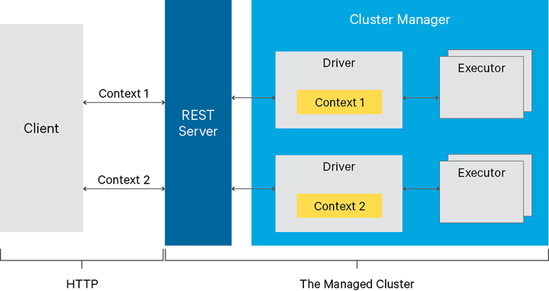

# Apache Livy 应用实践

## Livy 是什么？- A REST Service for Apache Spark
```md
Livy 是一款开源的Spark服务化工具，通过 REST Service 来和 Spark 集群交互。

Livy 总体来说实现了两个方面的功能：
1. Livy 接受并解析用户的REST请求，转换成相应的操作，即实现了Spark提供的基本功能（提交任务、查询任务结果），
   Livy通过 REST 服务来提供，带来易用性的同时提供了更大的灵活性;  
2. Livy 管理着用户所启动的所有Spark集群，提供企业应用中不可忽视的多用户，安全，以及容错的支持，这是 Spark 集群本身所不具备的。
```
* [Livy 架构图](https://livy.incubator.apache.org/)


Livy 具体的细节可以查看官网（[Apache Livy](https://livy.incubator.apache.org/)）。

## Why Livy？
```md
前面讲了一些 Livy 给 Spark 带来的变化，确实给 使用 Spark 带来了更好的体验。
但好像也只是 锦上添花的作用，下面我们就来看一个 只有 Livy 才能实现的场景。

首先，我们回顾下 Spark提交任务的 模式：
1. 批处理模式 脚本 spark-submit.sh
2. 交互模式 脚本 spark-submit.sh
   当然这种模式也包括 通过 Spark 提供的 thriftserver 来提交。

如果需要基于 Spark 做一个动态查询系统，如果采用批处理的方式，就需要在 客户端 去调用脚本 来提交任务，
这样的体验方式，一般的系统都不会采用，那只能选择第二种方式的 thriftserver 来接受任务的提交。

但是原生的 thriftserver 交互模式 存在一些 问题：
1. 无法动态的控制并发数（需要提前启动一定数量的 thriftserver）；
  Livy 能动态的控制任务的并发，只要控制 Livy 的 Session 个数就能实现动态并发执行任务。
2. thriftserver 启动时 设置的参数无法动态改变，
  如 Spark 的运行模式 是 Spark on Yarn 时，
  如果 希望每一个用户在自己的队列上提交和运行任务，是无法做到的，这就是 多租户 需求。
  Livy 的 Session 启动时 可以动态设置 绑定的参数，当然包含 执行队列的设置。
  而 Session 的创建是动态的，可以按需创建。
```
> 所以如果你有以上使用 Spark 的需求，那使用 Livy 吧。

## Livy Session
```md
Session 可以说是 Livy 的核心概念，Session 同我们平常理解的会话含义是一致。
```
* 类型
```md
1. 批处理会话（batch session）
2. 交互式会话（interactive session）
对应 Spark 任务的两种提交方式

批处理会话 在任务执行完成后就自动销毁了，交互式会话 会一直存在，除非 Livy 进行回收。
这里我们主要看下 交互式会话 的使用方式。
```
* 创建
```md
通过 POST /sessions 
Livy Session 启动后，会绑定 一个 Spark Driver，Session 会使用创建时提交的参数来 初始化 Spark Driver，
两者的生命周期是一致的，对 Session 的操作最终都转化为 对 Spark Driver的操作。
```
* 管理
> * Session 并发机制
```md
Session 在存活的状态下，可以一直处理 Spark 任务，但一个 Session 上的任务执行是串行的，
通过 FIFO 队列来管理 任务。

所以如果需要加大并发，就需要 创建多个 Session 来处理任务，这里要注意：
1. Session 是占用一定的资源的
（实际上是 Spark Driver 会占用 YARN 上的资源，Session 本身占用的资源是很少的）；
2. 并发数量过大之后，Livy 的 API 接口响应 时间会变大（资源被挤占）。

所以 Session 的数量需要根据 集群的资源 做一个合理配置。

极端情况下，如果你需要任务没有等待的情况，那就需要 控制 每个 Session 只执行一个任务，
执行完成后，再执行下一个任务。
这就需要分布式锁来控制 Session 的任务数，同时监控 Session 的状态。
```
> * Session 回收机制
```md
另外 Livy 有 Session 的回收机制，当 Session 空闲一段时间后，会被回收释放集群上的资源，
这个时间的合理设置，对 资源的 管控也是很重要的。
```
> * Session 容错机制
```md
Livy 对 Session 会做持久化，当集群失败后，重启时会 自动恢复。
所以 客户端 需要 配合处理 容错的场景。
```

## Livy 客户端开发
### [API](https://github.com/cloudera/livy#prerequisites)
```md
1. REST API 的 session 接口 提交代码段方式运行；
2. REST API 的 batch 接口提交 jar包 方式运行；
3. 使用Using the Programmatic API，通过程序接口提交作业。
```

### [REST API Session](https://livy.incubator.apache.org/docs/latest/rest-api.html)
#### Session
> > * GET /sessions - Sessions 信息
```md
获取 Livy 实例 上所有 session 的信息，这个接口返回的信息非常详细，
也带来一个问题，就是 Session 数量过大是，接口响应会变慢。可以做 二次开发，对接口 进行 拆解。

使用场景:
当需要批量获取 Session 状态时使用。
如需要再 客户端 对 Session 进行负载均衡（在 多Livy 实例的情况下，尽量控制 各个实例上的Session 数保持均衡）。
```
> > * POST /sessions - 交互式 Session 创建
```md
Session 创建是异步的，创建请求提交后，会同步返回 Session ID，但 Session 是否创建成功需要轮询 查询接口来获取。

重要参数 ：
kind ： Session 类型，支持 Scala、Python、R、Spark SQL 任务类型。
queue ： 资源队列名。
```
> > * GET /sessions/{sessionId} - Session 总体信息
```md
使用场景:
控制 Session 上执行的任务数可以通过查询该接口获取 Session上执行的任务情况。

```
> > * GET /sessions/{sessionId}/state Session 状态信息
```md
使用场景:
上述 创建接口后，异步查询 Session 状态调用此接口。
```
#### Satement
> > * POST /sessions/{sessionId}/statements - 异步提交任务
> > * GET /sessions/{sessionId}/statements/{statementId} - 查询任务状态
> > * POST /sessions/{sessionId}/statements/{statementId}/cancel - 删除任务
> > * POST /sessions/{sessionId}/completion - 同步提交任务（用于任务快速执行完成的场景）

#### 思考
```md
1. Livy 集群可以通过zk来做服务发现，同时做负载均衡。
   但实际上 Livy 提供服务的 是 Session，Livy 实例级别的负载均衡太粗了。
   所以在 客户端 实际上要实现 Session 的负载均衡。
2. 多实例情况下，Session 提供服务的地址是 Host + Port + SessionId，
   由于 Session 和 任务相关的接口 很多都是异步的，所有客户端实际上需要记录 提供服务的 Session，
   可以保存在 Redis 中，供 客户端 实例共享。
   另外一种方法是，通过 Hash 一致性来 索引 Session，好处是，Session对上层逻辑代码透明。
3. 客户端 Session 的管理实际上 和 Livy 的实现相关的，从业务代码的角度看，实际上不太关心。
   如果 Session 管理的代码 散步在 业务代码中，会增加 代码的复杂度，
   所以建议 在 客户端 实现专门的 Session 资源管理器。
4. 客户端 要实现 Session 的容错机制
   一个方案是 实现 监控器 来监控 Session 的状态，及时同步 Session 状态，剔除无法提供服务的Session等。
```


