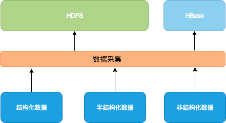

# 大数据 - 数据采集
```md
By sunnnychan@gmail.com
2018-10-01
```

## 数据采集的工作

```md
再来看下上面这张图，可以很清楚的看出 数据采集 处理 数据源 和 数据存储之间，
从数据源获取数据，然后处理（这个过程通常被称为ETL），然后转储至存储系统。

因此，数据采集可以理解为是一个管道，或者是数据的加工流水线。
```
## 数据采集的场景
### 业务场景
* 希望保留历史数据以备数据挖掘与分析（OLAP）
```md
  将数据同步到HDFS中，让HDFS成为备份了完整数据的冗余存储，
  此时的数据采集就是一个简单的同步过程。
```
* 数据源是Kafka，需要实时采集数据
```md
  这时的数据采集是Kafka的消费者，要注意这里是流处理方式。
```
* 数据源是特殊格式文件，需提取特征数据（如视频文件）
```md
  这个场景下的数据采集会更加复杂，耗时更长。
```
### 数据同步服务
```md
主要处理的是不同系统组件之间的数据导入导出工作。
也就是输入和输出的数据源是异构的，比如 将MySQL 的数据采集到 Hive 中。
```
## ETL
```md
ETL 的含义是 Extract、Transform、 Load（数据抽取、数据转换、数据加载）。

ETL 工作的实质 就是从各个数据源提取数据，对数据进行转换，并最终加载填充数据到数据仓库维度建模后的表中。
对于构建数据仓库来说，ETL 就是数据采集的代表，是实施数据仓库的重要步骤。
而 ETL 作为数据仓库的核心和灵魂，能够按照统一的规则集成并提高数据的价值。
```
* 抽取（Extract）
```md
根据数据仓库主题、主题域确定需要从应用数据库中提取的数。
```
* 清洗（Cleaning）
```md
主要包括以下工作：
* 数据补缺
* 数据替换
* 格式规范化
* 主外键约束
```
* 转换（Transform）
```md
对提取好了的数据的结构进行转换，以满足目标数据仓库模型的过程。

主要包括以下工作：
* 数据合并
* 数据拆分
* 数据验证
  行列互换、排序/修改序号、去除重复记录等

有时候也把 数据清洗部分的工作 归入 数据转换。
```
* 装载（Load）
```md
将已经提取好的保证数据质量的数据加载到目标数据仓库。
```
```md
ETL 简单了讲 就是倒数据的工具，复杂了讲 是数据整合解决方案。
所以从实现上讲，也会区分为简单实现和复杂的实现。
```
## 数据采集系统
```md
数据采集系统可以看做是一个数据管道，它的设计完全取决于数据源的特性和最终的数据应用场景。

由于数据源具有更复杂的多样性，数据采集的形式也变得更加复杂而多样。

在一些数据应用场景下，数据采集系统需要对数据做一些处理。
所以异构的数据经过数据采集系统，最终可能是同构的。
```
### 常见数据采集系统和实现框架
* 系统日志采集系统
```md
常见 日志采集框架：
Apache Flume
Scribe
LogStash - 是 ELK 套件中的一个组件，负责日志采集和转换。
Camus - 是 Linkedin开发的基于Kafka消费日志，批量写入 Hdfs的一个工具。
```
* 网络数据采集系统
```md
一般是使用网络爬虫，从网络上获取数据。

常见的 网络爬虫框架：
Apache Nutch
Crawler4j
Scrapy
```
* 数据库采集系统
```md
Canal - 阿里的MySql增量数据同步工具
```
### 混合数据采集框架
* Apache Sqoop


### 数据采集系统 常见架构

