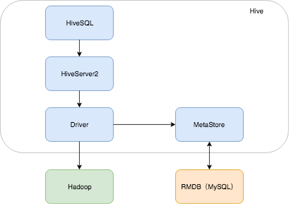
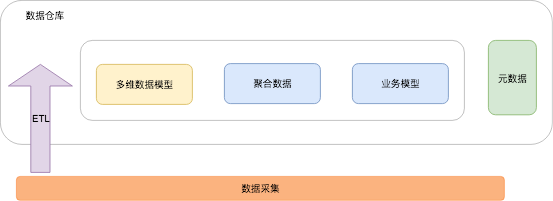
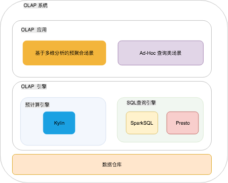
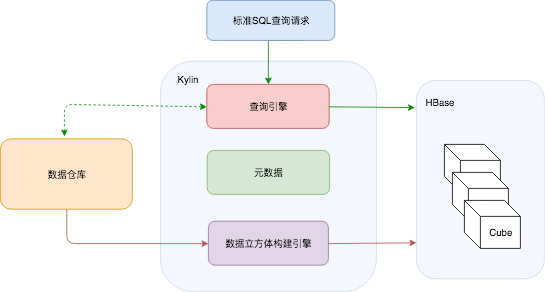

#  大数据 - 数据仓库
> By sunnnychan@gmail.com

## 引言
```md
在讲述数据采集时，提到过数据仓库的概念，本篇做一个详细的讲述。
单独讲述数据仓库是因为它也属于大数据基础设施的范畴，是 OLAP（联机分析处理）应用的基础。
从很多企业都有专门的数仓团队就可以看它的重要性。

本篇不会讲述数据仓库的原理和如何设计，关于这些话题网络上有更专业的文章。
主要从数据应用的角度来讲述下 数据仓库是什么，数据仓库的应用，以及用于构建数据仓库的工具 Hive。
```

### 数据仓库是什么
```md
从问题领域范围看，数据仓库中的数据是面向一定的业务主题的，将一个问题域的相关数据集成在一起。
从数据物理结构看，数据仓库存放的是结构化的数据，和其它离线数据的是一样的，都是以文件的形式存放在HDFS上。
从数据逻辑结构看，数据之间是存在业务逻辑关系的，会针对业务逻辑对数据进行重新建模，
这就是为什么数据仓库工程师需要深入理解业务逻辑的原因，只有这样才能更好的对业务数据进行建模，
进而才能为查询层提供更好的体验。实际上数据仓库的优化最重要的工作也在这里。
从应用角度看，数据仓库主要面向数据分析和决策支持。

从上面的表述可以看出，数据仓库中的数据是具有一定的特性，如果从数据采集系统采集的数据不符合这些特性，
就需要利用 ETL 工具对数据进行 抽取、转换 再加载进 HDFS，最终的数据是一致的、准确的、干净的。

数据存储进 HDFS，还需要对数据建模。目前 Hive 是构架数仓的主要工具，我们先来了解下Hive。
```

### Hive
* Hive 架构简图  


```md
上图中，简化了Hive的架构，也是 Hive 的主要使用方式。从下往上看：
Hive 使用的数据计算框架是 Hadoop 的 MapReduce，
Driver 的作用是生成任务执行计划，并发送给 MapReduce执行，
HiveServer2 负责接收任务。
图中我们采用的是 HiveSQL 来提交任务。HiveQL 和 MySql 的语法很相似。

到目前为止你可能觉得很奇怪，HDFS上存储的文件都没有库表的概念，怎么可以用SQL去做查询呢？
这就是 MetaStore 的作用，当你使用 HiveSQL 执行的是 DDL 语句时，就会对 HDFS 上的文件进行库表的建模。
而库表的建模信息是通过 MetaStore 存储在关系型数据库中的，一般使用 MySQL，这部分数据称为元数据。

MetaData 是构建数据仓库的一个关键，
从物理结构上看，MySQL 中存储的元数据 和 HDFS 上存储的实体数据，就构成了数据仓库。
实际从逻辑结构上看，数据仓库的实现要复杂的多。
```

### 数据仓库与关系型数据库
```md
如果从 Hive 构建数仓的方式看，数仓和传统的关系型数据存在一定的相似性，如：
1. 都是通过SQL来操作，包括 DDL、DML，而 HiveQL 和 MySql 的语法很相似；
2. 数据的组织方式都是采用 库表模式。

所以数仓有时候也被称为 分析性数据库。（这里的数据库已经是一个延伸意义上的概念了，实际上近些年数据库的概念在不断的扩大）

分析性数据库与关系型数据的区别在于：
1. 分析性数据库的数据是相对稳定的，数据进入数据仓库之后很少发生修改。
   因为数据主要是用来做分析的，读取就好了。而关系型数据库的读写都比较频繁。
2. 事务的概念在分析性数据库中很弱，Hive 只是到最近才开始有限的支持事务。
   而关系型数据库的一个重要特征就是事务，没有事务从传统的数据库设计角度看，是不能称之为数据库的。
3. Hive 中的元数据和业务数据是分开存储的，元数据一般采用 关系型 数据库存储。
4. 本质上来讲，SQL的执行原理也是不一样的，Hive 是将 SQL 转换成 MapReduce 程序来执行，
   所以实际上也可以直接写 MapReduce 程序来跑任务，但是这样做学习的成本太高了，
   而 SQL 是一个通用的结构化查询语言，大家比较熟悉。
5. 关系型数据库一般采用 行式存储，而分析性数据库 一般采用列式存储更能提升查询效率。
6. 应用场景不一样，数据仓库的主要应用是OLAP，而关系数据库的场景是OLTP。
```

### 数据仓库业务建模
```md
到这里你应该对数据仓库有一个初略的认识了，但是实际上数据仓库不是简单的建库建表这么简单。
我们来描述下 数据仓库的业务建模，这也是构建数据仓库的难点。
因为这里面包含了业务的复杂性，没有完全通用的解决方案，需要根据实际的业务场景和应用场景来具体设计。
```


* 多维数据模型
```md
是为了满足用户从多角度多维度对数据进行观察和分析的需求，而建立起来的基于事实表和维度表的数据库模型。
```
* 聚合数据
```md
是基于一定需求的简单聚合（更加复杂的聚合体现在多维数据模型中的基于多维数据的聚合）。
聚合 可以简单理解为，对数据的汇总和统计，如计算 总和、最大值、最小值、平均值等。
```
* 业务模型
```md
多维数据模型是一种通用的分析模型，而业务模型是基于某些数据分析和决策支持而建立起来，
如 用户评价模型、关联推荐模型等，或者是决策支持的线性规划模型、库存模型等。
所以 数据挖掘 的数据基础 也在这里完成。
```
```md
整体上看，每个企业都会构建公司级的数据仓库，而各个部门和各个产品线可以构建自己的数据集市。
数据集市 是 数据仓库的子集，专注于 某个 业务主题。
```
### OLAP
```md
OLAP （On-Line Analytical Processing）是数据仓库的主要应用，说到 OLAP 就必须要提 OLTP，
OLTP （On-Line Transaction Processing）是关系型数据库的主要应用。
这么一对比，你再回顾下前面的 数据仓库与关系型数据库 章节，就基本能理解 什么是 OLAP 了。
```

```md
从数据访问场景看，OLAP 实现分为： 
以报表应用为代表的固化分析场景，一般使用 Kylin 来实现基于多维数据的预聚合；
以Ad-Hoc查询为代表的灵活分析场景，一般采用 低延时的 SQL 查询引擎实现，如 SparkSQL，Presto，Impala等。
```

### 多维数据分析
```
多维数据模型的 核心 是 维度，
比如 我们经常需要 对比 每天的订单量，天 就是 维度，对比 不同 城市的 订单量，城市 就是维度，
如果 我们把 天 和 城市 结合分析，如 对比 每天 不同城市的订单量，还可以继续增加维度。
这就是 多维 分析 场景。

多维数据分析实现的重点是构建多维数据集，主要采用 数据立方体（Cube）进行构造。
然后提供 上卷、下钻、切片、旋转 等操作来多角度的观察和分析数据。
```

### Kylin
```md
这里简单说下， Kylin 是如何 解决 OLAP 中的 固化分析 问题的。
固化分析场景是指，用户的分析需求 已提前预知，如 用户在 BI 平台 设计了一个 报表，
除非用户做修改，否则这个 报表 展示时需要提取的 维度 和 指标，以及其上的聚合操作都是确定的。
根据数据仓库的特性，数据一般都是 在某个 固定时间点进行更新，所以只要在数据更新后，
提前做预计算，将结果存放在 HBase，那么 用户 每次打开报表看到的数据都是最新数据。

Kylin 的核心思想就是预计算，将用户设定的多维分析需求，转化为多维数据立方体，
缓存至 HBase中，以供查询时直接访问。

由于提前做了预计算，决定了 Kylin 能够拥有很好的快速查询和高并发能力。
但由于需要针对每一个需求构建多维数据立方体，会耗费更多的存储空间。
从这里看， Kylin 使用的是 空间 换 时间的思想。 
```


```md
红色 和 绿色线 分别表示 离线数据流 和 在线分析数据流，分别 对应 构建 数据立方体的预计算流程，
和 数据查询流程。

通常 在 BI 类产品设计时，用户保存了报表的设计之后，会有一个准备数据的时间差，
这个时间差就是，把用户的设计转换成 查询需求，提交给 Kylin 构建 多维数据立方体，并保存至 HBase的过程。
```

### 备注
> * 数据仓库 和 数据挖掘
```md 
数据仓库 是一种数据组织技术，对于 数据挖掘 来说是一样基础服务，是一类 数据源。
数据挖掘 是一种数据分析技术, 可针对数据仓库中的数据进行分析。

也可以说，数据挖掘是 数据仓库的一个应用方向。
```