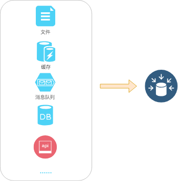
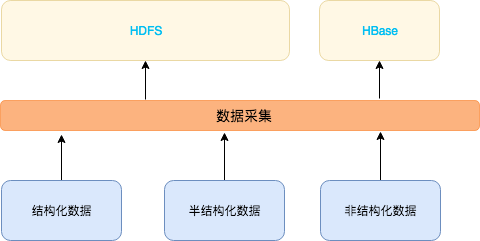
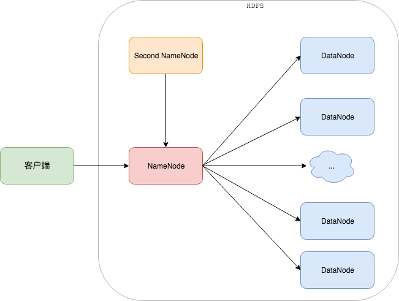
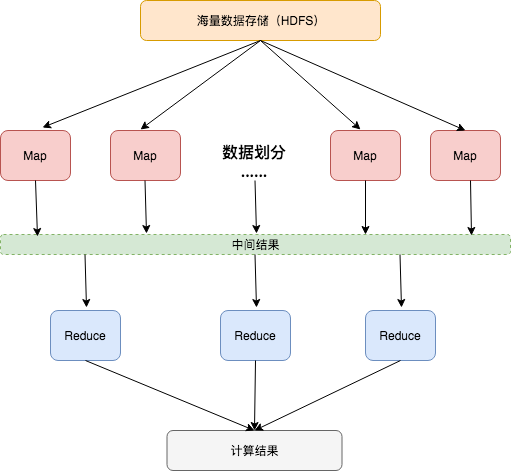

#  大数据 - 出发
```md
By sunnnychan@gmail.com
```

[TOC]  


## 引言
```md
整个大数据的生态体系十分庞大，繁多的概念，很多技术还处在一个蓬勃发展的阶段。
希望以我目前的认知范围、 能用简单的语言 来讲述清楚什么是大数据。

本篇主要从大数据的处理流程的角度来初步描述什么是大数据。
这也是这些列文章的一个主线，后续的文章基本是对一些部分展开。
```

## 起源
```md
计算机从一开始出现，就是用来处理数据的，计算+数据（存储） 是计算机程序的 主要组成部分。
从这个方面来讲，大数据就是 数据 在达到一定的量级，怎么处理这些数据的问题。
（一般大数据的量级用海量数据来表述，目前大多框架能支持P级数据的处理）

计算机本身就是被设计用来处理人类无法处理的高量级问题的，这本身并没有什么问题，
但当数据量上升到一定量级时（T、P级），传统的数据处理方式已经没有办法处理了，所以大数据的处理需要自成一套体系。

大数据的概念起始于 Google 发表的三篇论文，但是 Google 没有开源相关产品。
Google 的搜索引擎产品本身处理的就是海量的网页数据，我觉得这也是 Google 引领大数据行业的一个原因（有技术的积累）。
对标 Google 的三篇论文，开源社区开发了 ：
1. HDFS : Hadoop 分布式文件系统 对应 Google GFS；
2. MapReduce : Hadoop 并行计算框架，对应 Google MapReduce；
3. HBase : 分布式 NoSQL 列数据库，对应 Google BigTable。
它们构成了大数据处理的初始框架。
```

## 从处理流程看大数据


### 数据源
```md
数据源如其名，它指的是数据的来源，数据存储的源头就是数据源。
而大数据处理的数据就来之于数据源。

具体看，企业系统中能产生数据的地方都可以作为数据的来源，也即数据源。
```


[有关数据源更详细的内容请点击这里](bigdata-datasource.md)

### 数据采集
```md
数据采集是从数据源采集数据转储的过程。
实际上，从数据采集开始，才是大数据处理的开始。(就是要开始实际的做一些事情了)
数据采集的目标是将从数据源获取的数据，转储到大数据的海量数据存储系统（暂时可以理解为 HDFS）。
```

```
为什么需要做数据的转储，好像是数据冗余了？
如果直接从业务系统读取数据做运算：
(1) 技术上要解决业务系统的异构问题，无法形成统一的解决方案，还存在数据安全、业务安全等问题。
(2) 业务系统的存储容量是有限的，而且很多没有容错机制，存在数据丢失的现象。
(3) 有些场景的数据是非持久化的，例如消息队列，接口类，需要实时采集，然后转储。
(4) 跨业务系统的数据分析，更加困难。
从企业的角度看：
现在大多数的企业对数据的理解已经上升到作为一种重要的企业资产，
基本所有的企业都建有数据中心，将所有的企业数据都收纳至数据中心进行统一的管理，提供一个统一的数据出口。

数据采集系统可以看做是一个数据管道，它的设计完全取决于数据源的特性和最终的数据应用场景。
由于数据源的多样性，数据采集系统需要针对不同的场景做不同的处理。
不同的数据应用场景下，有时候数据采集系统需要对数据做一些处理。所以异构的数据经过数据采集系统，最终可能是同构的。

对于构建数据仓库来说，ETL（Extract、Transform、 Load，数据抽取、数据转换、数据加载）就是数据采集的代表。
数据采集之后，通过 Hive 构建完数据仓库，数据就表现为 Hive 的一张张 表。
```
### 数据存储
```md
数据存储是经过数据采集之后海量数据持久化存放的问题。数据存储系统是数据采集系统数据输出的目的地。
存储格式一般是文件，存储介质主要是磁盘。

需要解决的问题是主要有：
怎样高效、廉价的存储海量数据，以及解决容错、安全等方面的问题；
采用什么样的数据格式进行存储，以方便后续高效的查询。

流式数据 可能没有数据转储的问题，因为数据都是直接从数据源实时读取，实时处理，实时获取结果。
批处理数据 需要经数据采集后转储，所以后续的描述都针对批处理的场景。

HDFS 是一个典型的海量数据持久化存储系统，目前大多数的处理架构都是基于HDFS的。
也就是说，在数据存储这一层，大多人的还是 HDFS。
```
* HDFS 结构  

```md
HDFS 可以理解为相比 NFS（网络文件系统） 解决了文件存储的高效管理、容错性、安全性等问题，
HDFS 可以使数据存储在廉价的设备上，并且理论上可以无限线性扩展。
HDFS 使用 NameNode 来管理文件信息， DataNode 来管理数据。
```

```md
说到大数据必须要先说 Hadoop，我们在大数据起源提到了 Hadoop，它可以说是开源大数据产品的起步，
所以造成了很多人从技术上对大数据的认知就是 Hadoop，甚至很多人提到大数据的第一影响就是 Hadoop。

狭义的 Hadoop 指的是 Hadoop 产品，实际就是 HDFS + MapReduce，
是一个大数据的批处理框架。初始版本的 MapReduce 由于设计的原因存在可用性缺陷，目前应升级到 YARN。

广义的 Hadoop 是指基于 Hadoop 产品 发展出来一些列技术，这个家族很庞大，而且还在不断发展。
```
### 数据计算
```md
最早的分布式计算框架是 MapReduce，简单来说，MapReduce 就是“任务的分解和结果的汇总”。
```
* MapReduce 计算模型

```md
Map 对任务进行分解，分解的主要目标是使计算尽量靠近数据，尽量达到都在本地进行计算，以减少数据传输，节省带宽。
Reduce 对分解后的任务产生的结果进行汇总（聚合），最终得到结果。

Hadoop MapReduce 实现中，计算的中间结果通常会频繁的写进读出 HDFS，大家知道磁盘是很慢的，
Hive 是基于 MapReduce 框架的，所以 Hive 的查询 从整体上看是比较慢的，
但这种框架的好处是稳定（有时候稳定可能是最大的需求）。

Spark 充分利用内存计算和结果缓存，重新设计了分布式计算框架，优化了内存数据结构，
经过这些优化，在速度上比Hive提升了一个量级。
当然你可能会想有了更快的Spark，Hive 是不是可以退出历史舞台了？这个问题我们在大数据处理框架时再做说明。
```
### 数据查询
```md
数据查询 和 数据计算 是 紧密联系的，狭义上讲 数据查询 指的是 数据查询的接口或者说方式，
目前大多数的查询引擎 都支持 SQL 查询的方式，这也应该会成为 以后查询引擎的标配。
现在的查询引擎一般都有自己的 计算框架，都会在一定的应用场景或架构设计上做一些优化。

整体上看，目前在数据查询和数据计算方向上的优化是热点，所以各种查询引擎也层出不穷，
除了上述的Spark、Hive，目前应用较多的还有 Kilyn，Presto，Drill，Impala，Dremio等。
这些查询引擎都有各自的特点。

从数据计算的架构看，Spark、Hive 都是基于 Hadoop 的通用计算框架，
这种架构的优点是灵活性高，支持细粒度容错，集群扩展性好，缺点是效率无法保证。
这类查询引擎适合做 批处理查询，一般用于复杂的 ETL 处理，数据挖掘，高级分析，
对查询的延迟不做要求，但是稳定性是必备的指标。

Presto，Drill，Impala 采用 MPP（大规模并行处理）架构，
特点是查询速度快（在秒级甚至毫秒级以内就可以返回查询结果），缺点是稳定性较差，并发度有限，可扩展性不足。
但是仅查询快这点就有很大的价值，这也是考察各类查询引擎的一项硬性指标。
这类查询引擎适合做 交互式查询 或者 即席（Ad-Hoc）查询，追求低延迟，而不过分强调查询内部容错。

还有一类的查询场景是查询任务是预知的，如报表系统、BI分析类应用，用户会提前设计好查询任务。
这部分的应用可以做预计算，这是也是 Kilyn 应用场景。将数据结果提前计算好，存入 HBase，
用户查询时直接从HBase中读取结果，当数据更新时，进行刷新。通常这类查询是毫秒级延时。
```
### 数据应用
```md
基于上面的处理，接下来构建各类数据应用。
先系统的描述下主要的应用方向，后续再单独做一个讲述。

从大的应用方向上看，主要分为以下几个方向：
数据分析  
  离线场景: 报表系统、商业智能分析（BI）、即席（Ad-Hoc）查询、数据地图、用户画像、知识图谱等。
  实时场景: 反欺诈、监控、实时推荐等.
数据挖掘
机器学习
AI 也可以作为大数据的一个应用方向，或者说大数据是AI的基础。

从整体上看，是一个递进的关系，从 描述数据，到挖掘数据之间的内在关系，再到做决策。
```
### 总结
```md
如果看到后面大数据处理架构部分，你会发现上面描述的处理过程完全体现在整体的架构中，
你会看到的是一个自下而上的分层式架构。
```
### 最后
```md
1. 大数据中的很多概念没有清晰的边界，理解这些概念一定要结合问题的领域，
   很多大数据的概念涉及多个问题领域，这是造成困惑的一个重要原因。
   所以结合场景才能有更好的理解。
2. 上面描述的 数据处理过程，只是一个 主流程，还有一些分支的流程以及一些细节的处理方式，
   如 数据传输，数据序列化等。只描述 主要流程 是为了有一个清晰的脉络。
```