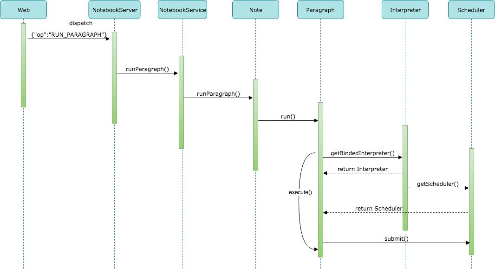
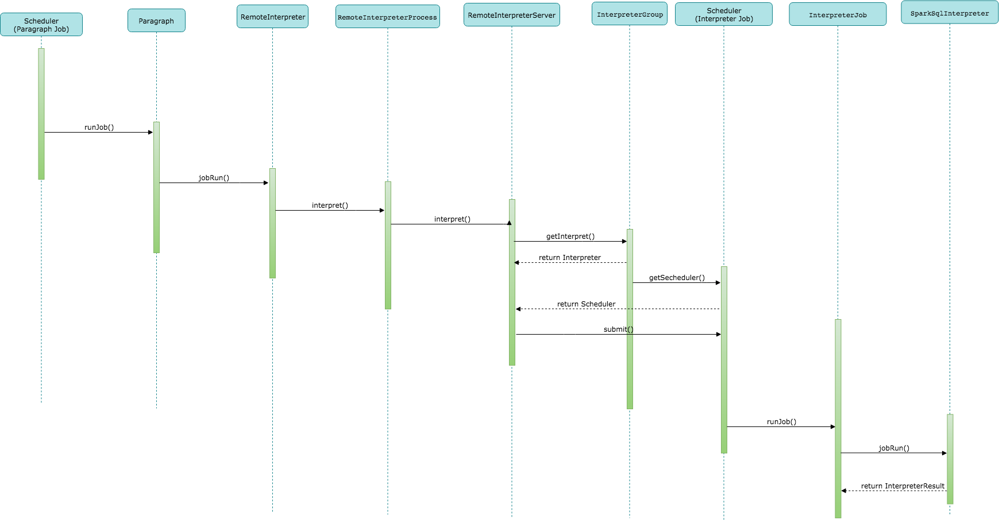
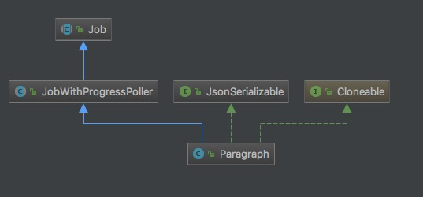
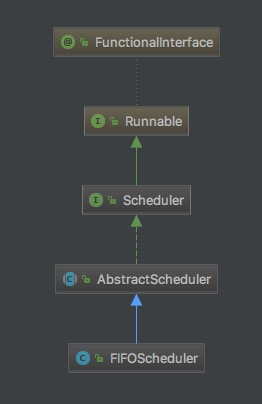

# Apache_Zeppelin_0.9 源码阅读 - [Paragraph 执行过程]

开始分析之前，推荐搭建一个环境，这样理解起来会更容易些。
搭建环境的过程可以参考：
**[《大数据分析平台实践 - 如何搭建一套完成的大数据分析平台》](https://github.com/SunnnyChan/knowledge-Sys-of-bigdata/blob/master/practice/data-analytics-deploy/)**
```md
Paragraph 执行过程 是 Zeppelin 的核心流程，搞定这部分的流程，
基本上就对Zeppelin 的原理和代码 有一个很深入的认识了。
```
```md
我把 Paragraph 执行过程分为4个步骤：
1. 解析执行参数，构建 Paragraph Job 提交至 Scheduler；
2. Scheduler 根据策略 调度 Paragraph Job，提交至 RemoteInterpreterServer 执行；
3. RemoteInterpreterServer 解析参数，构建 Interpreter Job 提交至 Scheduler；
4. Scheduler 根据策略 调度 Interpreter Job，最终由适配的 Interpreter 来执行，并返回执行结果。
```
```md
Paragraph 执行的逻辑主要涉及 zeppelin-server、zeppelin-zengine、zeppelin-interperter
三个模块的代码，它们也是 Zeppelin 的核心模块。
```
```md
以下以 Spark SQL 为例，对 Paragraph 执行过程做一个源码分析。
```

## 1. 提交 Paragraph Job 至 Scheduler

```md
Zeppelin Server 服务基于 Jetty 构建，提供 WebSocket 服务 和 基于 Jersey 实现的 RESETful API 服务。
数据交互场景基本使用 WebSocket 服务，Note 相关操作使用 RESETful API 服务。

Paragraph 执行的 入口 API 有两个：
NotebookRestApi 类中实现的 RESETful API ("job/{noteId}/{paragraphId}")；
NotebookServer 类中实现的 WebSocket API （"RUN_PARAGRAPH"）。
``` 
```md
WebSocket 是基于事件驱动的方式实现的，当有请求提交时，事件会由 onMessage(NotebookSocket conn, String msg);
方法来处理，这个方法通过 请求参数中的 "OP" 字段来做 WebSocket API 的路由，

“RUN_PARAGRAPH” 会路由至 runParagraph(conn, messagereceived) 方法执行。
```
```java
  private void runParagraph(NotebookSocket conn,
                            Message fromMessage) throws IOException {
    String paragraphId = (String) fromMessage.get("id");
    String noteId = connectionManager.getAssociatedNoteId(conn);
    String text = (String) fromMessage.get("paragraph");
    String title = (String) fromMessage.get("title");
    Map<String, Object> params = (Map<String, Object>) fromMessage.get("params");
    Map<String, Object> config = (Map<String, Object>) fromMessage.get("config");
    getNotebookService().runParagraph(noteId, paragraphId, title, text, params, config,
        false, false, getServiceContext(fromMessage),
        new WebSocketServiceCallback<Paragraph>(conn) {
          @Override
          public void onSuccess(Paragraph p, ServiceContext context) throws IOException {
            super.onSuccess(p, context);
            if (p.getNote().isPersonalizedMode()) {
              Paragraph p2 = p.getNote().clearPersonalizedParagraphOutput(paragraphId,
                  context.getAutheInfo().getUser());
              connectionManager.unicastParagraph(p.getNote(), p2, context.getAutheInfo().getUser());
            }
            // if it's the last paragraph and not empty, let's add a new one
            boolean isTheLastParagraph = p.getNote().isLastParagraph(paragraphId);
            if (!(Strings.isNullOrEmpty(p.getText()) ||
                Strings.isNullOrEmpty(p.getScriptText())) &&
                isTheLastParagraph) {
              Paragraph newPara = p.getNote().addNewParagraph(p.getAuthenticationInfo());
              broadcastNewParagraph(p.getNote(), newPara);
            }
          }
        });
  }
```
```md
根据 WebSocket 连接管理器 来获取关联的 noteId，
（可以看出 一个 note 最多对应一个 WebSocket连接，而实际上一个 WebSocket 连接可以关联 多个 note）。

然后主要是调用 NoteBookService 的 runParagraph()，同时注册 WebSocketService 回调接口，
用来向 客户端 发送执行结果。
```
* 1.1 org.apache.zeppelin.service.NotebookService runParagraph()
```md
先获取 Note note = notebook.getNote(noteId); 
在根据 paragraphId 从 Note 中获取 Paragraph p = note.getParagraph(paragraphId);
Note 中的 Paragraph 信息，是在 Note 实例化时，从持久化设备中反序列化而来。
后续单独再 讲解 Note 的 Create 流程。
```
```java
  public boolean runParagraph(String noteId,
                              String paragraphId,
                              String title,
                              String text,
                              Map<String, Object> params,
                              Map<String, Object> config,
                              boolean failIfDisabled,
                              boolean blocking,
                              ServiceContext context,
                              ServiceCallback<Paragraph> callback) throws IOException {

    if (!checkPermission(noteId, Permission.RUNNER, Message.OP.RUN_PARAGRAPH, context, callback)) {
      return false;
    }

    Note note = notebook.getNote(noteId);
    if (note == null) {
      callback.onFailure(new NoteNotFoundException(noteId), context);
      return false;
    }
    Paragraph p = note.getParagraph(paragraphId);
    if (p == null) {
      callback.onFailure(new ParagraphNotFoundException(paragraphId), context);
      return false;
    }
    if (failIfDisabled && !p.isEnabled()) {
      callback.onFailure(new IOException("paragraph is disabled."), context);
      return false;
    }
    p.setText(text);
    p.setTitle(title);
    p.setAuthenticationInfo(context.getAutheInfo());
    p.settings.setParams(params);
    p.setConfig(config);

    if (note.isPersonalizedMode()) {
      p = note.getParagraph(paragraphId);
      p.setText(text);
      p.setTitle(title);
      p.setAuthenticationInfo(context.getAutheInfo());
      p.settings.setParams(params);
      p.setConfig(config);
    }

    try {
      notebook.saveNote(note, context.getAutheInfo());
      boolean result = note.run(p.getId(), blocking);
      callback.onSuccess(p, context);
      return result;
    } catch (Exception ex) {
      LOGGER.error("Exception from run", ex);
      p.setReturn(new InterpreterResult(InterpreterResult.Code.ERROR, ex.getMessage()), ex);
      p.setStatus(Job.Status.ERROR);
      // don't call callback.onFailure, we just need to display the error message
      // in paragraph result section instead of pop up the error window.
      return false;
    }
  }
```
```java
主要是调 Note 的 run() 方法，执行 Paragraph。

set 方法的参数 都来至调用函数：
    String text = (String) fromMessage.get("paragraph");
    String title = (String) fromMessage.get("title");
    Map<String, Object> params = (Map<String, Object>) fromMessage.get("params");
    Map<String, Object> config = (Map<String, Object>) fromMessage.get("config");
可以看出是从，Websocket 请求消息 “data” 节点中读取的。

重点关注下 text 的处理：
在调用 setText(） 方法时，再调用 parseText() 解析 Text。
```
* 1.2 org.apache.zeppelin.notebook.Note run()
```java
  public boolean run(String paragraphId, boolean blocking) {
    Paragraph p = getParagraph(paragraphId);
    p.setListener(this.paragraphJobListener);
    return p.execute(blocking);
  }
```
* 1.3 org.apache.zeppelin.notebook.Paragraph execute()
```java
this.interpreter = getBindedInterpreter();
interpreter.getScheduler().submit(this);
```
```md
getBindedInterpreter() 的流程后续再讲解，这里大致知道这个方法主要是获取绑定的Interpreter，
以便下面获取对应的 Scheduler 来提交 Paragraph Job。
```
```md
Scheduler 的 submit 在 抽象类 org.apache.zeppelin.scheduler.AbstractScheduler 中实现：
```
```java
  @Override
  public void submit(Job job) {
    job.setStatus(Job.Status.PENDING);
    queue.add(job);
    jobs.put(job.getId(), job);
  }
```

## 2. 提交 Paragraph Job 至 RemoteInterpreterServer

```md
看下 Paragraph 类 和 Scheduler （Scheduler 有多个实现，以 FIFOScheduler 为例） 的继承结构：
```


```md
可以看出 Paragraph 类 继承了 抽象类 Job，而 Job 是 Scheduler 的处理对象。
```
```md
还可以看出 Scheduler 接口 继承了 Runnable 接口。
所以 Scheduler 是以线程方式运行，线程启动后 调用 AbstractScheduler run() 方法开始执行。
```
* 2.1 org.apache.zeppelin.scheduler.AbstractScheduler
```java
 @Override
  public void run() {
    while (!terminate) {
      Job runningJob = null;
      try {
        runningJob = queue.take();
      } catch (InterruptedException e) {
        LOGGER.warn("{} is interrupted", getClass().getSimpleName(), e);
        break;
      }

      runJobInScheduler(runningJob);
    }
  }

  public abstract void runJobInScheduler(Job job);
```
```md
Scheduler 以线程 方式启动后，就一直从队列里消费 Job，取出 Job 后调用 runJobInScheduler() 方法处理，
具体的 处理逻辑由 子类来实现。
```
***org.apache.zeppelin.scheduler.FIFOScheduler***
```java
/**
 * FIFOScheduler runs submitted job sequentially
 */
public class FIFOScheduler extends AbstractScheduler {

  private Executor executor;

  FIFOScheduler(String name) {
    super(name);
    executor = Executors.newSingleThreadExecutor(
        new SchedulerThreadFactory("FIFOScheduler-Worker-"));
  }

  @Override
  public void runJobInScheduler(final Job job) {
    // run job in the SingleThreadExecutor since this is FIFO.
    executor.execute(() -> runJob(job));
  }
}
```
```md
FIFOScheduler 是以一个单线程的 线程池来 串行执行 Job的。
FIFOScheduler 重写了 runJobInScheduler() 方法，最终调用 Paragraph 的 runJob(job)。
```
* 2.2 org.apache.zeppelin.notebook.Paragraph jobRun()
```java
  @Override
  protected InterpreterResult jobRun() throws Throwable {
    this.runtimeInfos.clear();
    this.interpreter = getBindedInterpreter();
    if (this.interpreter == null) {
      LOGGER.error("Can not find interpreter name " + intpText);
      throw new RuntimeException("Can not find interpreter for " + intpText);
    }
    LOGGER.info("Run paragraph [paragraph_id: {}, interpreter: {}, note_id: {}, user: {}]",
        getId(), this.interpreter.getClassName(), note.getId(), subject.getUser());
    InterpreterSetting interpreterSetting = ((ManagedInterpreterGroup)
        interpreter.getInterpreterGroup()).getInterpreterSetting();
    if (interpreterSetting != null) {
      interpreterSetting.waitForReady();
    }
    if (this.user != null) {
      if (subject != null && !interpreterSetting.isUserAuthorized(subject.getUsersAndRoles())) {
        String msg = String.format("%s has no permission for %s", subject.getUser(), intpText);
        LOGGER.error(msg);
        return new InterpreterResult(Code.ERROR, msg);
      }
    }

    for (Paragraph p : userParagraphMap.values()) {
      p.setText(getText());
    }

    // inject form
    String script = this.scriptText;
    if (interpreter.getFormType() == FormType.NATIVE) {
      settings.clear();
    } else if (interpreter.getFormType() == FormType.SIMPLE) {
      // inputs will be built from script body
      LinkedHashMap<String, Input> inputs = Input.extractSimpleQueryForm(script, false);
      LinkedHashMap<String, Input> noteInputs = Input.extractSimpleQueryForm(script, true);
      final AngularObjectRegistry angularRegistry =
          interpreter.getInterpreterGroup().getAngularObjectRegistry();
      String scriptBody = extractVariablesFromAngularRegistry(script, inputs, angularRegistry);

      settings.setForms(inputs);
      if (!noteInputs.isEmpty()) {
        if (!note.getNoteForms().isEmpty()) {
          Map<String, Input> currentNoteForms =  note.getNoteForms();
          for (String s : noteInputs.keySet()) {
            if (!currentNoteForms.containsKey(s)) {
              currentNoteForms.put(s, noteInputs.get(s));
            }
          }
        } else {
          note.setNoteForms(noteInputs);
        }
      }
      script = Input.getSimpleQuery(note.getNoteParams(), scriptBody, true);
      script = Input.getSimpleQuery(settings.getParams(), script, false);
    }
    LOGGER.debug("RUN : " + script);
    try {
      InterpreterContext context = getInterpreterContext();
      InterpreterContext.set(context);
      InterpreterResult ret = interpreter.interpret(script, context);

      if (interpreter.getFormType() == FormType.NATIVE) {
        note.setNoteParams(context.getNoteGui().getParams());
        note.setNoteForms(context.getNoteGui().getForms());
      }

      if (Code.KEEP_PREVIOUS_RESULT == ret.code()) {
        return getReturn();
      }

      context.out.flush();
      List<InterpreterResultMessage> resultMessages = context.out.toInterpreterResultMessage();
      resultMessages.addAll(ret.message());
      InterpreterResult res = new InterpreterResult(ret.code(), resultMessages);
      Paragraph p = getUserParagraph(getUser());
      if (null != p) {
        p.setResult(res);
        p.settings.setParams(settings.getParams());
      }

      // After the paragraph is executed,
      // need to apply the paragraph to the configuration in the
      // `interpreter-setting.json` config
      if (this.configSettingNeedUpdate) {
        this.configSettingNeedUpdate = false;
        InterpreterSettingManager intpSettingManager
            = this.note.getInterpreterSettingManager();
        if (null != intpSettingManager) {
          InterpreterGroup intpGroup = interpreter.getInterpreterGroup();
          if (null != intpGroup && intpGroup instanceof ManagedInterpreterGroup) {
            String name = ((ManagedInterpreterGroup) intpGroup).getInterpreterSetting().getName();
            Map<String, Object> config
                = intpSettingManager.getConfigSetting(name);
            applyConfigSetting(config);
          }
        }
      }

      return res;
    } finally {
      InterpreterContext.remove();
    }
  }
```
```md
InterpreterResult ret = interpreter.interpret(script, context);
调 RemoteInterpreter interpret() 方法执行。
```
* 2.3 org.apache.zeppelin.interpreter.remote.RemoteInterpreter
```java
  @Override
  public InterpreterResult interpret(final String st, final InterpreterContext context)
      throws InterpreterException {
    if (LOGGER.isDebugEnabled()) {
      LOGGER.debug("st:\n{}", st);
    }

    final FormType form = getFormType();
    RemoteInterpreterProcess interpreterProcess = null;
    try {
      interpreterProcess = getOrCreateInterpreterProcess();
    } catch (IOException e) {
      throw new InterpreterException(e);
    }
    this.lifecycleManager.onInterpreterUse(this.getInterpreterGroup(), sessionId);
    return interpreterProcess.callRemoteFunction(
        new RemoteInterpreterProcess.RemoteFunction<InterpreterResult>() {
          @Override
          public InterpreterResult call(Client client) throws Exception {

            RemoteInterpreterResult remoteResult = client.interpret(
                sessionId, className, st, convert(context));
            Map<String, Object> remoteConfig = (Map<String, Object>) gson.fromJson(
                remoteResult.getConfig(), new TypeToken<Map<String, Object>>() {
                }.getType());
            context.getConfig().clear();
            if (remoteConfig != null) {
              context.getConfig().putAll(remoteConfig);
            }
            GUI currentGUI = context.getGui();
            GUI currentNoteGUI = context.getNoteGui();
            if (form == FormType.NATIVE) {
              GUI remoteGui = GUI.fromJson(remoteResult.getGui());
              GUI remoteNoteGui = GUI.fromJson(remoteResult.getNoteGui());
              currentGUI.clear();
              currentGUI.setParams(remoteGui.getParams());
              currentGUI.setForms(remoteGui.getForms());
              currentNoteGUI.setParams(remoteNoteGui.getParams());
              currentNoteGUI.setForms(remoteNoteGui.getForms());
            } else if (form == FormType.SIMPLE) {
              final Map<String, Input> currentForms = currentGUI.getForms();
              final Map<String, Object> currentParams = currentGUI.getParams();
              final GUI remoteGUI = GUI.fromJson(remoteResult.getGui());
              final Map<String, Input> remoteForms = remoteGUI.getForms();
              final Map<String, Object> remoteParams = remoteGUI.getParams();
              currentForms.putAll(remoteForms);
              currentParams.putAll(remoteParams);
            }

            InterpreterResult result = convert(remoteResult);
            return result;
          }
        }
    );

  }
```
```md
重点看 ：

interpreterProcess = getOrCreateInterpreterProcess();
这是一个重要的支线流程，就是 获取 或 启动 RemoteInterpreterServer，后续会单独讲解，
简单说下 RemoteInterpreterServer，它是用 thrift 实现的Server，就是后续第四个步骤的逻辑都是它实现的，
它以独立的进程的方式运行，由 Zeppelin-Server 服务根据 用户绑定的 Interpreter 类型，已经共享方式来启动。
```
```md
RemoteInterpreterProcess 是 thrift 的客户端，负责和 RemoteInterpreterServer 通信，
RemoteInterpreterProcess 的 callRemoteFunction() 方法会回调 这里 注册的 call() 方法，
```
```java
RemoteInterpreterResult remoteResult = client.interpret(
  sessionId, className, st, convert(context));
```
```md
来提交 Paragraph Job 至 RemoteInterpreterServer，这是一次 thrift 请求。
```

## 3. 提交 Interpreter Job 至 Scheduler
* 3.1 org.apache.zeppelin.interpreter.remote.RemoteInterpreterServer interpret()
```java
  @Override
  public RemoteInterpreterResult interpret(String sessionId, String className, String st,
                                           RemoteInterpreterContext interpreterContext)
      throws TException {
    if (logger.isDebugEnabled()) {
      logger.debug("st:\n{}", st);
    }
    Interpreter intp = getInterpreter(sessionId, className);
    InterpreterContext context = convert(interpreterContext);
    context.setInterpreterClassName(intp.getClassName());

    Scheduler scheduler = intp.getScheduler();
    InterpretJobListener jobListener = new InterpretJobListener();
    InterpretJob job = new InterpretJob(
        interpreterContext.getParagraphId(),
        "RemoteInterpretJob_" + System.currentTimeMillis(),
        jobListener,
        intp,
        st,
        context);
    scheduler.submit(job);

    while (!job.isTerminated()) {
      synchronized (jobListener) {
        try {
          jobListener.wait(1000);
        } catch (InterruptedException e) {
          logger.info("Exception in RemoteInterpreterServer while interpret, jobListener.wait", e);
        }
      }
    }

    progressMap.remove(interpreterContext.getParagraphId());

    InterpreterResult  result = (InterpreterResult) job.getReturn();
    // in case of job abort in PENDING status, result can be null
    if (result == null) {
      result = new InterpreterResult(Code.KEEP_PREVIOUS_RESULT);
    }
    return convert(result,
        context.getConfig(),
        context.getGui(),
        context.getNoteGui());
  }
```
```md
主要是获取 Interpreter 和相关 Scheduler，构建 InterpretJob 提交至 Scheduler，
注意 InterpretJob 也继承了 Job 接口，所以 Scheduler 可以处理。
```

## 4. 调度执行 Interpreter Job 
```md
Scheduler的调度流程和 Paragraph 是一样的，但最后调用的是 Interpreter 的 jobRun() 方法。
然后 根据 绑定的 Interpreter 实际类型，如 SparkSQLInterpreter 来执行代码段，并返回执行结果。
```
