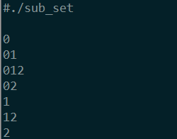
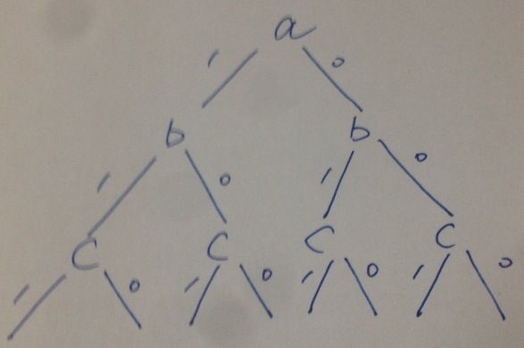
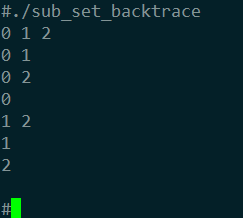

# 求集合子集 - 回溯法
> By SunnyChan (sunnnychan@gmail.com)
> 2015-04-20
```md
前面总结完位图解法，直到最近才有时间，继续对求子集的方法做一个整理。  
```
*回溯法有两种思路：*  
（1）第一种是将子集保存在一个字符数组中，每次往数组中移入一个元素，
从空集增加到最大集，再回溯，递归返回的时候，再将最后的元素从子集移出，
这样就实现了，元素在与不在子集中，这两种状态。

注意，每次加入一个元素得到的，子集数组中的元素就构成了一个子集。
```c
#include <stdio.h>
#include <stdlib.h>

void get_sub_set(char *start, char *end, char *str);

/**
 * @PARAM start表示还未添加到子集中的元素的开始位置 
 * @PARAM end表示集合最后一个元素的位置 
*/
void get_sub_set(char *start, char *end, char *str)
{
    char *p = start;
    int len = strlen(str);
    while (p <= end) /*向子集中依次添加未放入子集中的元素，一次一个*/
    {
        str[len] = *p; /*子集中添加一个未放入子集的元素。*/ 
        str[len + 1] = 0; 
        printf("%s \n",str);
        p++;
        get_sub_set(p, end, str); /* 把集合中的所有元素都加入子集中 */ 
        str[len] = 0; /* 递归返回的过程中，删除最后一个元素 */ 
    }
}

int main()
{
    //char set[] = "0123456789abcdefghij";
    char set[] = "012";
    int set_elem_count = strlen(set);
    char sub_list[set_elem_count];
    memset(sub_list,'\0', set_elem_count * sizeof(char));
    printf("%s \n",sub_list); // 初始时子集string为空集 
    get_sub_set(set, &set[set_elem_count - 1], sub_list); 

    return 0;
}
```
程序输出为：    

如果集合字符串为"0123456789abcdefghij" ，20个字符，算法的执行时间为15s左右（当然这个是跟机器的处理能力有很大关系的）。    

（2）第二种思路还是从元素在与不在子集这两种状态来考虑，因为每个元素都有两种状态，
可以理解为一种二叉树的形式，如下图：    
  

每一个元素带有一个属性，在不在子集中，1表示在子集，0表示不再自己中。  
每个元素的状态初始化为1，实际上无需去构造二叉树。  
第一个递归将所有元素逐个放入子集，当所有元素放入子集后回溯，  
第一次递归返回后，将最后一个元素移出子集，这样每个元素在与不在子集的状态都可以遍历到，  
每次遍历到最后一个元素时，按照元素的状态打印字符序列，得到的就是一个子集，  
参考上图就是每次遍历到c字符就打印子集，按照每一个a到c的路径，可以打印出所有的子集。  
```c
#include <stdio.h>
#define MAX_NUM 50

enum boolean {true=1,false=0};
typedef enum boolean bool;

void get_sub_set(bool * visit, char * set , int cur, int count);

void get_sub_set(bool * visit, char * set , int cur, int count)
{
    if ( set[cur] == '\0') {
        int i = 0;
        for (; i < count; ++i){
            if ( visit[i] ) {
                printf("%c ",set[i]);
            }

        }
        printf("\n");
        return;
    }
    visit[cur] = true;
    get_sub_set(visit, set, cur + 1, count);
    visit[cur] = false;
    get_sub_set(visit, set, cur + 1, count);
}

int main()
{
// char set[MAX_NUM] = "0123456789abcdefghij";
    char set[MAX_NUM] = "012";
    int count = 0;
    while ( set[count] != '\0' ){
        count ++;
    }
    
    bool visit[count];
    int i = 1;
    for (;i<=count;i++){
        visit[i] = false;
    }

    get_sub_set(visit, set,0,count);
    return 0;
}
```
程序输出为：  
  

如果集合字符串为"0123456789abcdefghij" ，20个字符，算法的执行时间为18s左右。