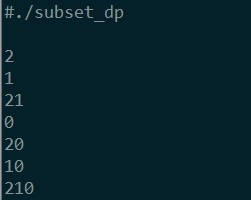

# 求集合子集 - 动态规划
> By SunnyChan (sunnnychan@gmail.com)
> 2015-04-20
利用动态规划的思想，也可以解决求子集的问题。  

例如 要求{1,2,3} 的子集，可以转化为求{2,3}的子集，再把元素1 加入到{2,3}的所有子集中，形成{1,2,3}的所有子集。  
以此类推，求{2,3}的子集可以转化为求{3}的子集，最终转化为求{}的子集，这是一个已知问题，空集的子集就是空集。  

注意，这个方法因为要保存子集的状态，所以花费的内存会较多。  
```c
#include <stdio.h>
#include <stdlib.h>

int get_sub_set(char * set, char ** set_list, int n);

/* Usage：获取所有子集
 * @PARAM ： set 在源集合中，求子集的开始位置，
 * 每次递归相当对 set 指针指向的字符至结束字符求子集
 * @PARAM ： set_list 字符数组，每个数组元素为一个子集字符串
 * @PARAM ： n 集合元素个数
 * @RETUEN : 子集的个数
 * */
int get_sub_set(char * set, char ** set_list, int n)
{
    int count = 1;
    if ( set[0] != '\0'){
        /* 递归直到源集合中最后一个元素 */
        count = get_sub_set( set + 1 , set_list, n);

        int curr = count; /*递归返回时子集个数，即 set[0] 后面左右字符的子集个数*/
        count = count * 2; /* 加入set[0] 字符，形成包含 set[0]字符的子集个数 */
    
        int i = curr ; /* 为新产生的子集分配内存 */
        for (; i < count; i ++){
            set_list[i] = (char *) malloc( (n + 1) * sizeof(char) ); 
        }

        i = curr ; /* 加入当前字符，形成新的子集 */
        int j = 0;
        int k = 0;
        for (; j < curr; j ++){
            k = 0;
            /* 逐个拷贝前面产生的子集，然后加入当前字符 */
            while (set_list[j][k] != '\0'){
                 set_list[i][k] = set_list[j][k];
                 k ++;
            }
             set_list[i][k] = set[0];
            set_list[i][k + 1] = '\0';
            i ++;
        }
    }

    /* 返回已经产生的子集个数 */
    return count;
}

int main()
{
    //char set[] = "0123456789abcdefghij";
    char set[] = "012";
    int set_count = strlen(set);
    int sub_set_count = 1 << set_count; /*所有子集的数目*/

    char **set_list; /* 字符串数组，保存所有的子集 */
    set_list = (char **) malloc( sub_set_count * sizeof(char *));
    /* 初始为空集 */
    set_list[0] = (char *) malloc( (set_count + 1 ) * sizeof(char) );
    set_list[0][0] = '\0';

    sub_set_count = get_sub_set(set, set_list, set_count);

    /* 打印所有子集，并释放堆内存 */
    int i = 0;
    for (; i < sub_set_count; i++){
        printf("%s \n",set_list[i]);
        free(set_list[i]);
    }

    free(set_list);
    return 0;
}
```
程序的输出为：  
  

如果集合字符串为"0123456789abcdefghij" ，20个字符，算法的执行时间为15s左右。  

求集合子集的几种方法，我都是在同一台服务器上执行的，性能的对比可以做一个简单的参考。
