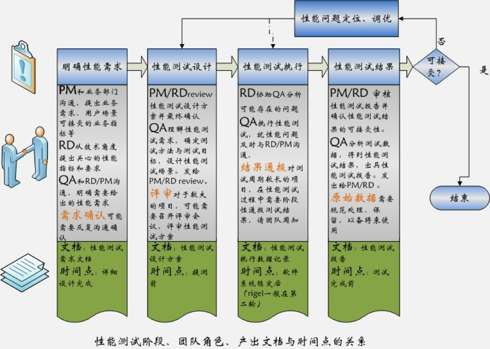
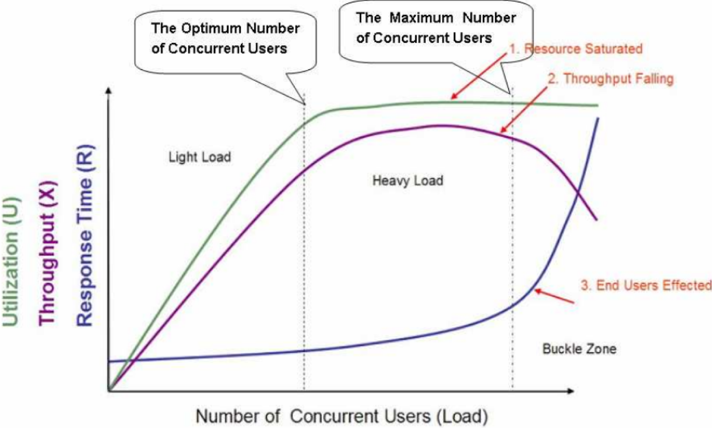
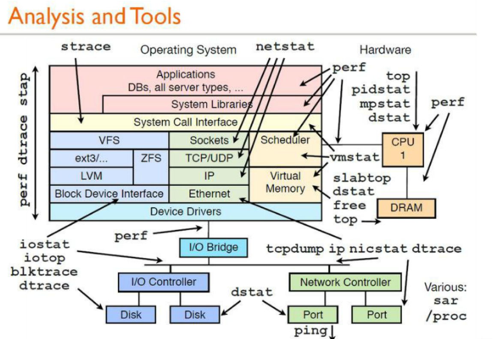
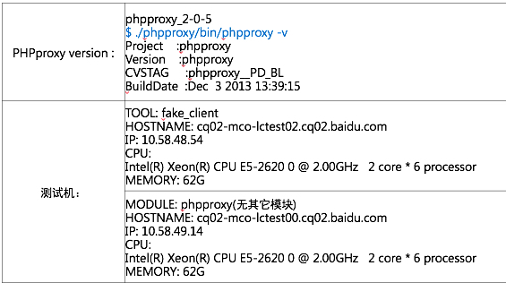
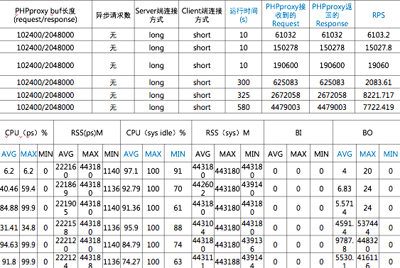
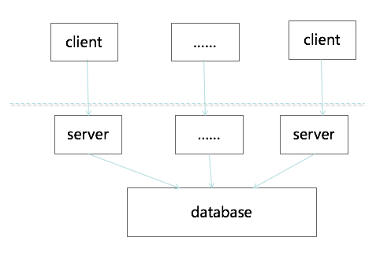
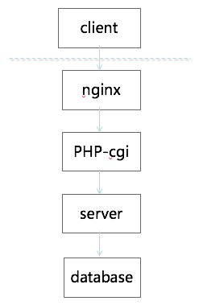

# 性能测试方法分析
> By SunnyChan (sunnnychan@gmail.com)

```md
曾经专职做过性能测试、分析、调优相关的工作。
该篇是我分享 性能测试 相关知识的PPT。主要分享如何规范的做性能测试。
先发布下文档，后续对章节做一些详细说明。
```
### 什么是性能？
```md
性能首先是一种指标，表明软件系统或构件对于其及时性要求的符合程度。
其次，是软件产品的一种特性，可以用时间来度量。
性能的及时性用响应时间或吞吐量来衡量。
```

### 什么是性能测试？
> 性能测试是一个完整的过程：
```md
观察系统在一个给定的环境和场景中的性能表现是否与预期目标一致
评判系统是否存在性能缺陷
并根据测试结果识别性能瓶颈
改善系统性能
```

### 区分不同的性能测试
* 狭义的性能测试(Performance Test)
```md
通过自动化的测试工具模拟多种正常、峰值以及异常负载条件来对系统的各项性能指标进行测试
```
* 负载测试(Load Test)
```md
确定在各种工作负载下系统的性能，目标是测试当负载逐渐增加时，系统各项性能指标的变化情况
```
* 压力测试(Stress Test)
```md
又称为强度测试，通过确定一个系统的瓶颈或者不能接受的性能点，来获得系统能提供的最大服务级别的测试
```

### 性能测试概念
* 公司服务模块或系统性能测试中的概念：
> * 性能测试：主要是指在给定大小的压力下服务器各项指标测试及服务的稳定性测试
> * 极限性能测试：类似于上面提到的压力测试，用于确定系统的瓶颈，包括但不限于：CPU，内存，硬盘IO，响应时间，请求响应比等

```md
平台稳定性测试是针对线上环境做适量的压力测试
性能测试是在线下搭建线上最小集的测试环境进行专业性能测试
```


### 性能测试目的
```md
是否满足上线要求？
系统极限承载如何？
系统设计与资源之间的最佳平衡？
     优化方案？
系统/模块极限压力？
系统模块稳定压力？
```

### 如何评价系统性能
* 用户视角（End-user）视角
```md
响应时间（Response Time）
```
* 开发者（Developer）视角
```md
响应时间（Response Time）
并发用户数（Concurrent Users）
吞吐量（Throughout）-每秒交易数（TPS）
资源利用率（Hardware/Software Resource Utilization）
可靠性或稳定性（Reliability or Stability）
可恢复性（Recoverability）
```

### QPS/TPS  
* Query per Second
```md
每秒的查询数
```

* Transactions Per Second
```md
每秒处理事务数
```

### 典型性能模型  


### 性能测试过程
```md
获取有效的性能测试需求
构建性能测试环境
确定性能测试场景
选取压力工具和监控工具
执行性能测试
分析请求失败原因
识别系统性能瓶颈
优化系统性能
输出性能测试报告
```

### 获取有效的性能需求
```md
客户方提出
根据历史数据来分析
参考其它同行类似项目的数据
```

* 例如：
> 系统用户数2w，并发用户数1000，系统响应时间小于5秒

### 构建性能测试环境
- *基本原则*
> ***性能测试环境与生产环境保持一致！***

### 构建性能测试环境考虑哪些因素
* 硬件型号、配置、数量
```md
重点关注CPU、内存、磁盘、网卡
```
* 软件、版本、配置
```md
操作系统、数据库、Web服务器、应用
```
* 网络、带宽
* 历史数据量
* 工具部署
```md
同机器、同机房还是跨机房
```

### 确定性能测试场景
> 以支付场景为例 ： 
* 场景1：
```md
历史数据，买家用户数100W，商户数1w，
使用不同买家，不同商户创建交易。
```
* 场景2：
```md
历史数据，买家用户数100W，商户数1w，
使用不同买家，同一商户创建交易。
```
### 选取性能测试压力工具
* 起压力工具（Client端）
> * HTTP协议（AB、Jmeter、EasyABC）
> * 其它协议（FakeClient、自写脚本）
* MOCK

### 性能测试监控工具
```md
CPU
内存
IO
网络
数据库
```


### MySQL监控与分析  
* 客户端连接进程数
```sql
mysql> show processlist;
```
* Innodb状态
```sql
mysql> show innodb status;
```
* 复制延时量
```sql
mysql > show slave status;
```
* QPS/TPS
```sql
mysql > show /* global */ status like 'Question';
mysql > show status like 'Com_commit';
```
* 慢查询
```sql
mysql> show variables like "%slow%";
/bin/mysqldumpslow
```
> 可以参考我曾经写的一个监控 MySQL 性能的脚本。[mysql_monitor](https://github.com/SunnnyChan/shell-utilities#mysql_monitor)

### 性能测试执行因素 （When ? ）


### 如何执行性能测试？
```md
逐渐等量的增加并发用户数
使用合适的增量间隔
执行足够多的迭代次数或者足够长的测试时间
每次执行之后还原测试环境
每次执行之后立即分析测试数据
```

### 分析请求失败原因
```md
请求超时
连接被拒绝
应用错误
数据库错误
系统崩溃
```

### 测试数据记录
  
  



### 性能瓶颈分析
* CPU/IO消耗场景
```md
特点：
高并发访问，cpu消耗
大数据传递，I/O消耗
```

### 系统性能优化
* 标准的性能调优过程：
```md
（1）确定基准环境、基准负载和基准性能指标。
（2）调整系统运行环境、实现方法、配置，执行测试。
（3）记录测试结果、进行分析。
```

### 输出性能测试报告
* 测试条件描述
> * 软硬件环境描述
> * 压力工具及压力方式描述
> * 压力值计算
> * 测试时间
* 监控信息：前面提及的关注指标
* 测试分析及结论
> *  测试数据分析，如：瓶颈在哪？为何会出现此瓶颈？是否有环境影响？----主要是为了提高性能测试数据的可信度
> *  测试结论，如：模块性能是否满足设计需求，改进建议

### 模块级性能测试（RPC CALL）


### 系统级性能测试（HTTP）


### 思考以下问题
```
性能测试开展的前提？
测试项的确认？
数据量多大合适？
多长时间合适？
极限的标准？
```

### *注*
> 部分内容来至网络，在此表示感谢！


