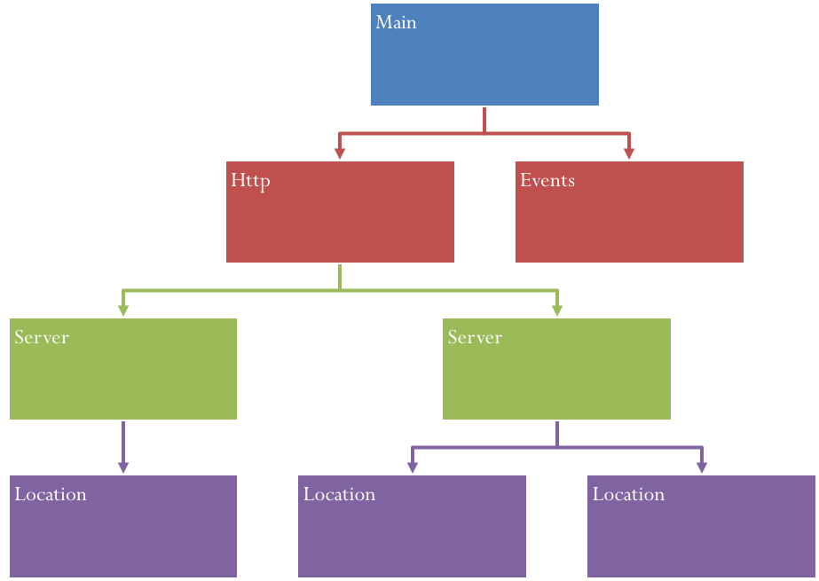
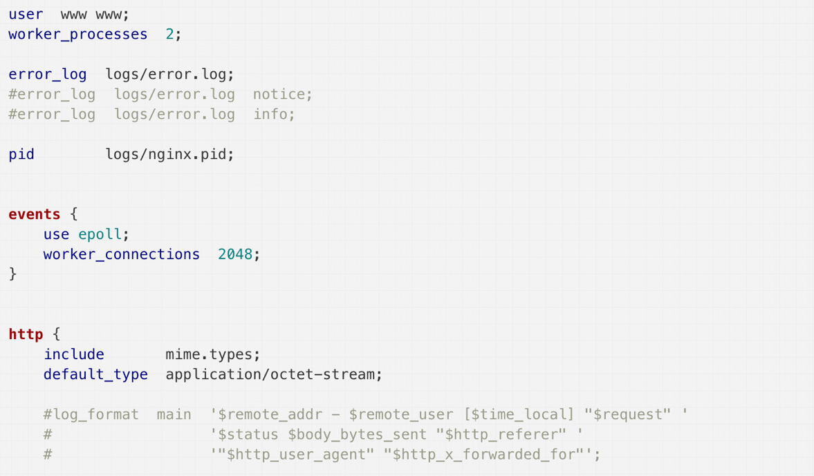
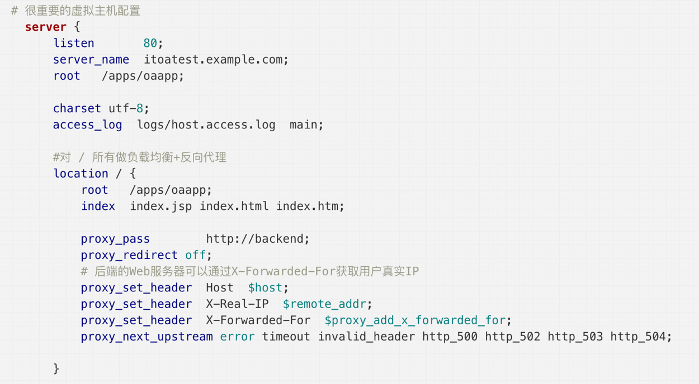
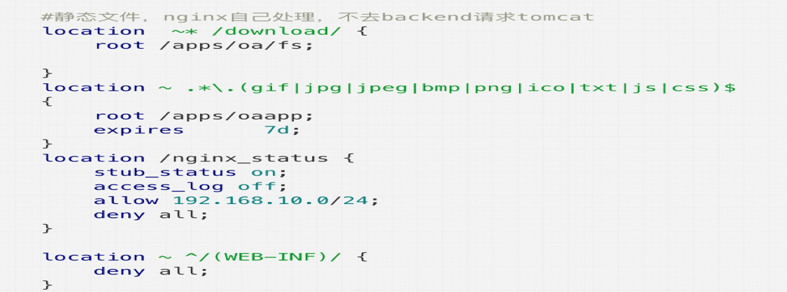
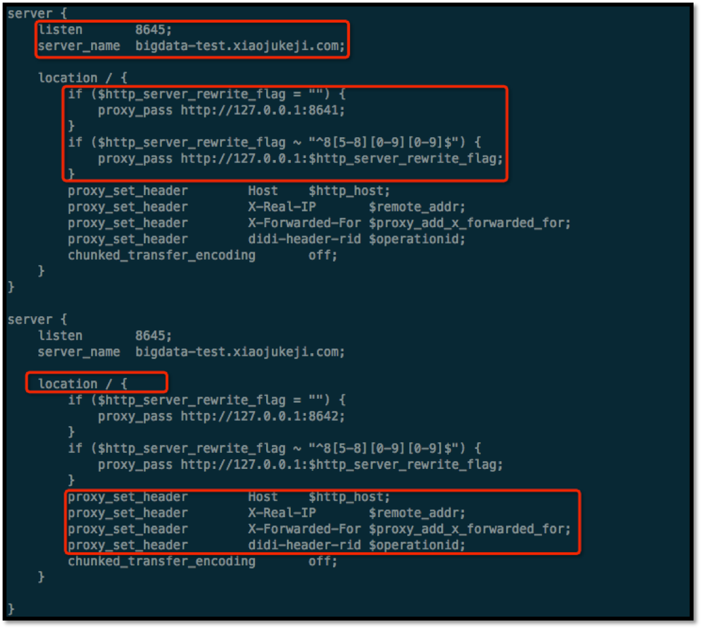
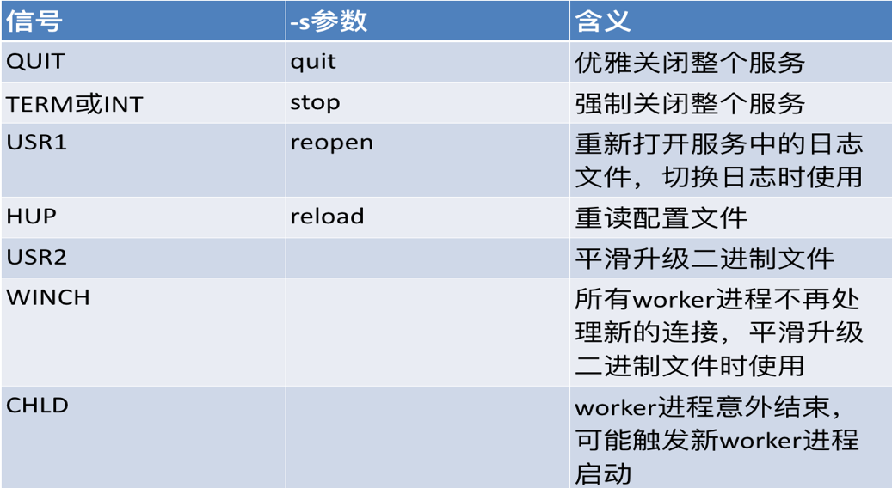

# Nginx 应用
> By SunnyChan (sunnnychan@gmail.com)

```md
该篇是我分享 Nginx 应用 相关知识的PPT。主要分享 Nginx 能做什么，怎么快速使用 Nginx 解决一些实际的问题。
先发布下文档，后续对章节做一些详细说明。
```

## Agenda
* [What’s Nginx](#What’s-Nginx)
* [Nginx 应用场景](#Nginx-应用场景)
* [Nginx 应用配置](#Nginx-应用配置)
* [Nginx 扩展应用](#Nginx-扩展应用)
* [Nginx 应用管理](#Nginx-应用管理)
* [Nginx 应用实例](#Nginx-应用实例)
* [Nginx 衍生发展](#Nginx-衍生发展)

### What’s Nginx
```md
高性能，非阻塞，事件驱动，低内存消耗
高可扩展，高度模块化
高可靠性，单master多worker工作模式，热部署 
灵活性，给web架构带来的弹性
```

### Nginx 应用场景
* HTTP Server
* 虚拟主机
* 反向代理
* 负载均衡
* 正向代理

#### HTTP Server
* 静态资源服务器
* 动静分离
* 访问控制
> * 基于来源地址访问控制
> * 基于用户认证 
* URL rewrite
> * “内部跳转”
> * “外部跳转”
* 防盗链
> * 定义合规引用
> * 判断不合规的引用
* 状态页
* 压缩

> ***Detail***
```
动静分离
 # 所有动态请求都转发给tomcat处理  
        location ~ .(jsp|do)$ {  
            proxy_pass  http://test;  
        } 

基于来源地址访问控制 （ngx_http_access_module模块实现）
location / {
    deny  192.168.1.1;
    allow 192.168.1.0/24;
    allow 10.1.1.0/16;
    allow 2001:0db8::/32;
    deny  all;
}
至上而下依次检查，默认为通过(被上面的匹配到了就直接允许或拒绝，下面的规则就不会检查了)

基于用户认证 （ngx_http_auth_baisc_module模块实现）
location /admin {                       # /admin对哪些路径进行用户认证
       
    auth_basic   "closed site";        # 提示语
    auth_basic_user_file conf/htpasswd;     # 密码的存放位置
}

建立下载站点 （gx_http_autoindex_module模块实现）

URL rewrite（ngx_http_rewrite_module实现）

防盗链 （ngx_http_referer_module实现）
valid_referers none blocked server_names
               *.example.com example.* www.example.org/galleries/
               ~\.google\.;

if ($invalid_referer) {
    return 403;
}

状态页由status模块实现
 
压缩  gzip模块实现

```

#### 虚拟主机

* 把一台物理服务器划分成多个“虚拟”的服务器
* 每一个虚拟主机都可以有独立的域名和独立的目录
* 通过nginx.conf中server节点指定的
* ngx_http_core_module（http核心模块）实现
* server_name a.test.com;
* 虚拟主机名可以有4种格式：
```md
（1）准确的名字，例如此例中的a.test.com
（2）*号开头的，例如 *.test.com
（3）*号结尾的，例如 mail.*
（4）正则表达式形式
```
* 优先级
```md
（1）确切的名字
（2）最长的以*起始的通配符名字
（3）最长的以*结束的通配符名字
（4）第一个匹配的正则表达式名字
```

#### 反向代理
* 指以代理服务器来接受Internet上的连接请求，然后将请求转发给内部网络上的服务器
* 两种模型
```md
作为内容服务器的替身
作为负载均衡器
```
* 作用
```md
隐藏实际的业务服务器
实现多个业服务器的负载均衡
对资源进行缓存
对用户的恶意请求做初步拦截
```
#### 负载均衡
* RR（默认）
```md
如果后端服务器down掉，能自动剔除
```
* 权重
```md
用于后端服务器性能不均的情况
```
* IP_hash
```md
解决session的问题
```
* fair（第三方）
```md
按后端服务器的响应时间来分配请求
```
* url_hash（第三方）
```md
后端服务器为缓存时比较有效
```

```
权重  指定轮询几率，weight和访问比率成正比，用于后端服务器性能不均的情况。
　　upstream test {
        server localhost:8080 weight=9;
        server localhost:8081 weight=1;
    }

```

### Nginx 应用配置
* main
```md
主要控制nginx子进程的所属用户/用户组、派生子进程数、错误日志位置/级别、pid位置、子进程优先级、进程对应cpu、进程能够打开的文件描述符数目等
```
* event
```md
控制nginx处理连接的方式
```
* http
```md
处理http请求的主要配置模块，大多数配置都在这里面进行
```
* server
```md
主机的配置块，可以配置多个虚拟主机
```
* location
```md
server中对应的目录级别的控制块，可以有多个
```
* upstream
```md
nginx做反向代理和负载均衡的配置块，可以有多个
```
#### 配置文件结构


#### nginx.conf




#### 配置指令
* location
```md
	•	=开头表示精确匹配
	•	^~ 开头表示uri以某个常规字符串开头，最长原则，不是正则匹配
	•	~ 开头表示区分大小写的正则匹配;
	•	~* 开头表示不区分大小写的正则匹配
	•	/ 通用匹配, 如果没有其它匹配,任何请求都会匹配到
```
> (location =) > (location 完整路径) > (location ^~ 路径) > (location ~,~* 正则顺序) > (location 部分起始路径) > (/)



* rewrite
```md
重写类型：
	◦	last ：  表示完成rewrite，浏览器地址栏URL地址不变
	◦	break；本条规则匹配完成后，终止匹配，不再匹配后面的规则，浏览器地址栏URL地址不变
	◦	redirect：返回302临时重定向，浏览器地址会显示跳转后的URL地址
	◦	permanent：返回301永久重定向，浏览器地址栏会显示跳转后的URL地址
```
```nginx
server {	
    # 访问 /last.html 的时候，页面内容重写到 /index.html 中
    rewrite /last.html /index.html last;
    # 访问 /break.html 的时候，页面内容重写到 /index.html 中，并停止后续的匹配
    rewrite /break.html /index.html break;
    # 访问 /redirect.html 的时候，页面直接302定向到 /index.html中
    rewrite /redirect.html /index.html redirect;
      # 访问 /permanent.html 的时候，页面直接301定向到 /index.html中
         rewrite /permanent.html /index.html permanent;
    # 把 /html/*.html => /post/*.html ，301定向
    rewrite ^/html/(.+?).html$ /post/$1.html permanent;
    # 把 /search/key => /search.html?keyword=key
    rewrite ^/search\/([^\/]+?)(\/|$) /search.html?keyword=$1 permanent;
}
```
```
rewrite和location功能有点像，都能实现跳转，
主要区别在于rewrite是在同一域名内更改获取资源的路径，
而location是对一类路径做控制访问或反向代理，可以proxy_pass到其他机器。

很多情况下rewrite也会写在location里，它们的执行顺序是：
	1	执行server块的rewrite指令
	2	执行location匹配
	3	执行选定的location中的rewrite指令
如果其中某步URI被重写，则重新循环执行1-3，直到找到真实存在的文件；循环超过10次，则返回500 Internal Server Error错误。

server阶段的rewrite执行完才会走到location中的rewrite阶段
```

* upstream
```nginx
upstream orp_inner_access_pool {
      ip_hash;
     server bfb-web-http.PAY.jx.serv:9080; # idc:jx
     server bfb-web-http.PAY.tc.serv:9080; # idc:tc
     server 127.0.0.1:9080 down;
 }

server {
   listen 8081;

    location / {
           proxy_pass http://opr_inner_access_pool;
    }
}
```

* > 默认情况下反向代理不会转发请求中Host头部信息
```nginx
proxy_set_header Host $host;
```

#### 配置语言特性
* 变量
> * 预设变量
```nginx
     $uri     '/soda'     (经过解码，不含参数)
     $request_uri     '/soda?xx=xiaoxuan'     (原始请求，未解码，含参数)  
     $arg_xx     ‘xiaoxuan’     （对应参数key的值）
     $http_xx     (请求头中的变量群)
     $cookie_xx     （cookie变量群）
     $send_http_xx     （相应头中的变量群）
```
> * 用户变量
```nginx
set $args “foo=1&bar=2”;
```
```md
生命周期
```
> * Map
```md
为一个变量设置的映射表，映射表由两列组成，匹配模式和对应的值。
```

* 逻辑控制
```nginx
if
```


## Nginx 扩展应用
* 限流
> * 限流总资源数
> * 限流某个接口的总并发/请求数
> * 计数器、漏桶和令牌桶算法

* 分流
> * 灰度发布
> * 流量复制
> * AB Test

## Nginx 应用管理
```sh
nginx -s reload 
nginx -s reopen 
nginx -s stop 
nginx -s quit 
```


## Nginx 应用实例
* 产品接入层
> 限流，url重写，abtest策略，请求分发给主站、运营等

* 运维接入层
> 请求分发给运行层集群或小流量集群 

* 运行层
> 接收http请求，使用cgi协议转发至上游处理

## Nginx 衍生发展
* 主要是基于 Lua 的扩展
> * 利用Lua语言灵活、小巧、嵌入式特性，结合Nginx强大的高并发特性，构建高性能应用

> * 两个实现
> > * [Openresty](https://openresty.org) - agentzh 
> > * [Tengine](https://github.com/alibaba/tengine) - 阿里巴巴

> 如果对 Openresty 感兴趣，可以关注我后续写的基于 Openresty 构建流量控制中心。
