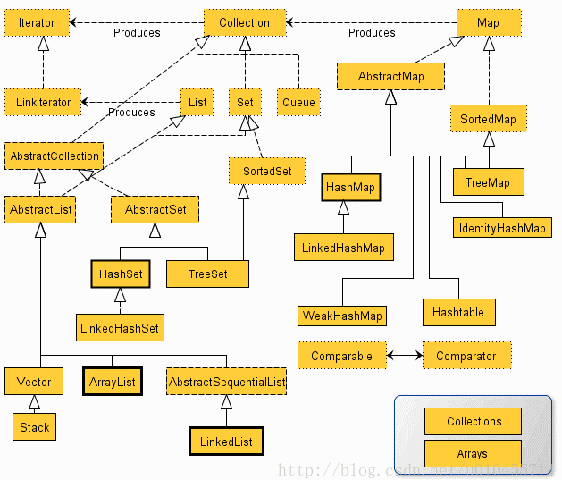

# Java 数据结构与算法

## 数据结构

* Container
```md
在Java当中，如果有一个类专门用来存放其它类的对象，这个类就叫做容器。
```
> * [Collection](java-collection/README.md)
> * [Map](java-map/README.md)

* [Array](java-array/README.md)
* [Queue](java-queue/README.md)


## 算法
* [Sorting]()


## 参考

* [Java Algorithms and Implementations](https://howtodoinjava.com/java-algorithms-implementations/)