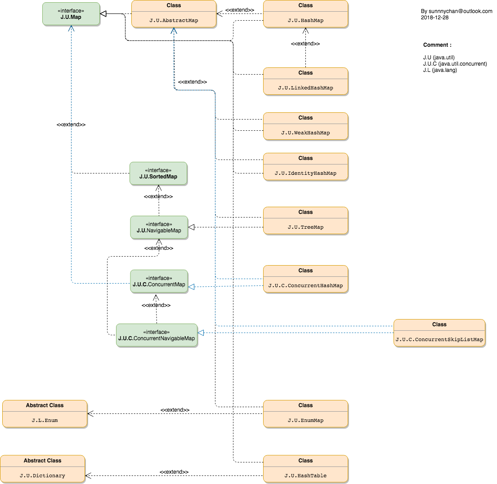

# Java Map

## interface
* [java.util.Collection](interface/java.util.Collection.md)

* [java.util.List](interface/java.util.List.md)

* [java.util.Set](interface/java.util.Set.md)
* [java.util.SortedSet](interface/java.util.SortedSet.md)
* [java.util.NavigableSet](interface/java.util.NavigableSet.md)

* [java.util.Queue](interface/java.util.Queue.md)
* [J.C.U.BlockingQueue](interface/J.C.U.BlockingQueue.md)
* [J.C.U.TransferQueue](interface/J.C.U.TransferQueue.md)
* [java.util.Deque](interface/java.util.Deque.md)
* [J.C.U.BlockingDeque](interface/J.C.U.BlockingDeque)

* [java.util.Map](interface/java.util.Map.md)
* [java.util.SortedMap](interface/java.util.SortedMap.md)
* [java.util.NavigableMap](interface/java.util.NavigableMap.md)

## Class
### Abstract Class
* [AbstractList]()
* [AbstractSequentialList]()

### Implemention Class

### Nested Class

## Collections Class Graph

## Map Class Graph
