# 中秋国庆双节行走广西 
> by SunnyChan 2018-11-21
> 发布 2012-10-07

```md
这是 2012 游广西写下的一篇游记，也是写的唯一一篇游记，发布在 QQ 空间。
每次看完都让我想起当时的很多细节，所以还是要坚持写，给生活留下些没的回忆。
```
```md
看够了三亚的碧海蓝天，有些想念大陆的秀丽山水，中秋国庆双节准备去广西自由行。
对广西不甚了解，只知桂林山水甲天下，还有就是省会是南宁，其它一无所知。
走之前赶紧恶补，买了本《行走广西》，书性价比极高，才十几块钱，写的很详细，遍布广西的大大小小景点都有介绍。

看完大致确定了一条线路：
三亚~海口~北海~南宁~桂林~龙胜~阳朔，然后直接返回，当然重点是看漓江山水。
从实际的效果看，这个路线还是不错的，除了回来时折腾一点，广西比较有名的景点基本都尽收眼底，也算心满意足了。
整理下行程，给大家去广西玩做个参考。
```
* 9.29  海口
```md
假从30号才开始放，为了赶晚上的班船，29号下午两点就出发了，约两个小时到达海口东火车站，
再打的去秀英港码头，打的费35块，有点被坑，回来时打的费27，哪里都有不厚道的人。
晚上7点的船，提前让李老板找朋友买好了票，朋友人很好，专门到码头送票给我们。
第一次坐比较大的船，有点小兴奋 。
```
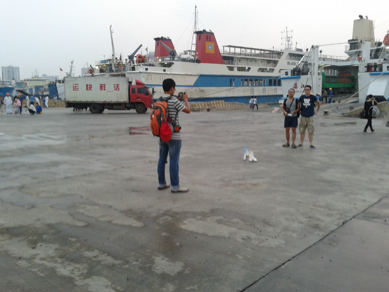

```md
6点10分左右登船，船主要是渡运货车，顺便搭客。考虑安全因素，买的二等船票，200块，好处是有个四个人的小房间，四张床，可以躺一躺。
船刚出港没多久，天就黑了，终于也体验了一次“海上升明月”的美景，明天才是中秋之夜，我提前把月圆之夜给欣赏了。

站在甲板上看着皎洁的月亮，听着潺潺的海浪，吹着徐徐的海风，很有感觉。
船离岸渐渐越来越远，海风越来越大，吹的有点头晕，回去就和衣而睡了。
在三亚总失眠，这一夜却睡的很好，原来旅行可以治疗失眠，呵呵。
```
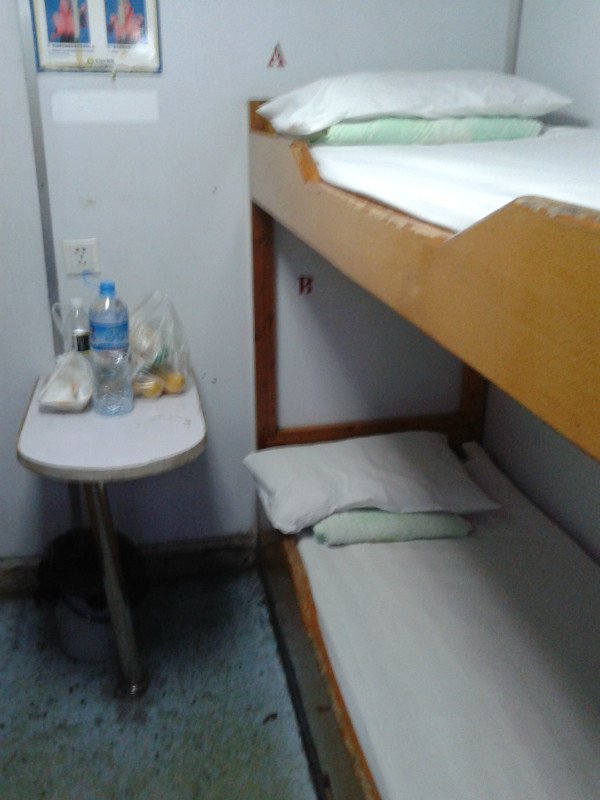

* 9.30 北海
```md
北海是海滨城市，最大的风景就是银滩和涠洲岛，但跟三亚比就差远了，所以也没打算去玩，来北海只是顺道，
而且听说这里的海鲜性价比极高，最大的目的就是中午吃一顿海鲜大餐，吃完就闪人去南宁。早上快7点，船到了北海港口，天刚亮。
码头停靠着无数的渔船，纳闷现在不是休渔期，这么强大的队伍怎么不出去捕鱼，正好保卫南海，呵呵。
```
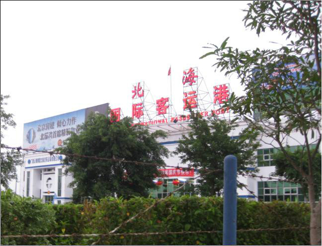
```md
上岸第一件事是先找火车站买票，不然所有的行程都可能被打乱。
找了个的士去火车站，结果8:10才上班，先找地方吃早饭吧，的士司机推荐了一个据说是比较不错的地方，
到了才发现也是空无一人，不得不感慨广西人生活怎么这么悠闲。

决定还是不折腾了，随便找个地方解决下算了，对面一家桂林米粉店，广西到处是米粉店，广西人的早餐一般就是一碗米粉。
米粉的味道不错，拌上酸菜、酸豆角、酸笋，很爽口，挺适合我的，
在广西这几天米粉也确实吃了不少，各式各样的尝个遍，不过听说柳州的米粉才算是最正宗的，这次是没机会吃到了。
```
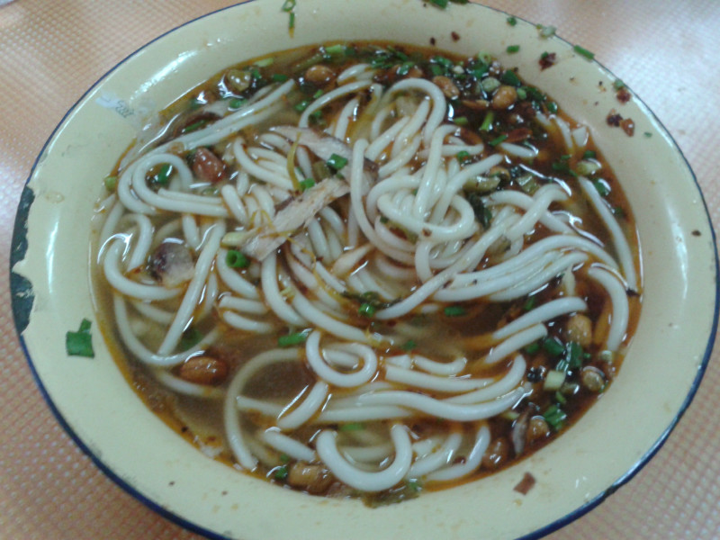
```md
吃完早饭，街面上人才渐渐多起来，经早上这么一折腾，也算对北海市有点了解了，有点失望，
上世纪九十年代就作为通商口岸开放的城市，发展的并不好，感觉就像个小县城，吃海鲜大餐的心情都没了，临时决定直接去南宁。
兵分两路分别去火车站、汽车站买票。
```
* 9.30 南宁
```md
北海只是个小站，可国庆到哪人都多，早上只有两班车去南宁，只买到站票，票价45 。
广西还未通高铁，都是那种老旧的火车，车速极慢，230公里左右的路程要开3个小时左右。要站3个小时，想想都觉得累了。
上了火车又一次哀怨，连站的地方都快没了。还好这种状态只持续了10几分钟，列车员车厢门一打开，赶紧往其它车厢跑，找座，哈哈。
刚走了一节车厢，居然好多空座，还有连坐的，赶紧霸占了，本打算坐一站是一站吧。奇了怪了，一路打牌到南宁，居然没人打搅我们。
真是幸运啊，呵呵！

到南宁快下午一点了，南宁绿化程度很高，全国所有城市排名第一，因此被称为“绿都”、“绿城”。
南宁不是旅游城市，住的地方很好找，还便宜。北湖南路上的如家标间才150，离火车站也不远，走之前预定的。
到酒店放完东西，赶紧需找美食，酒店前台推荐了不远处的一家桂林漓江人。
第一次体验广西菜，感觉还不错，阳朔的啤酒鱼最出名，期待已久，已经等不及到阳朔了，中午就尝了，味道还可以，不过离理想中的美味还有些差距。
```
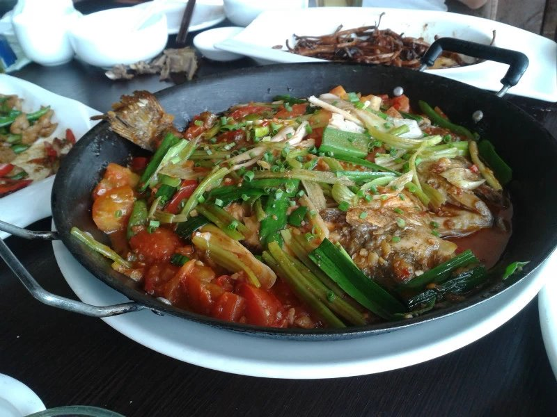
```md
酒足饭饱，开始安排接下来的行程，计划是明天去下德天瀑布，后天早上启程去桂林。
酒店对面就有火车票代售点，很方便，65块加5块钱手续费。
南宁每天都有去德天的班车，本打算自己去的，可是都觉得很累，不打算折腾了，
到酒店前台要了些旅行社的联系方式，报了个团，平时180，国庆涨价到200，现在是卖方市场，也只能这样了。
下午一觉睡到晚上8点，确实是太累了。

晚上准备去大吃一顿，赶紧掏攻略书，结果代TX居然没带，此后一路被我鄙视了N次。
还好有百度啦，中山路美食一条街，出发。眼花缭乱，逛完整条街，整了一堆吃的，找个地方坐下来开始我们的饕餮大餐。

最惊艳的就是烤鳄鱼肉，极具诱惑力，呵呵，不过吃了一颗就扔了，本来也只是想尝尝而已。
味道一般，估计卖点本就不是味道，只是卖个新奇。在南宁最大的收获就是变身吃货，尝尽美食。
```
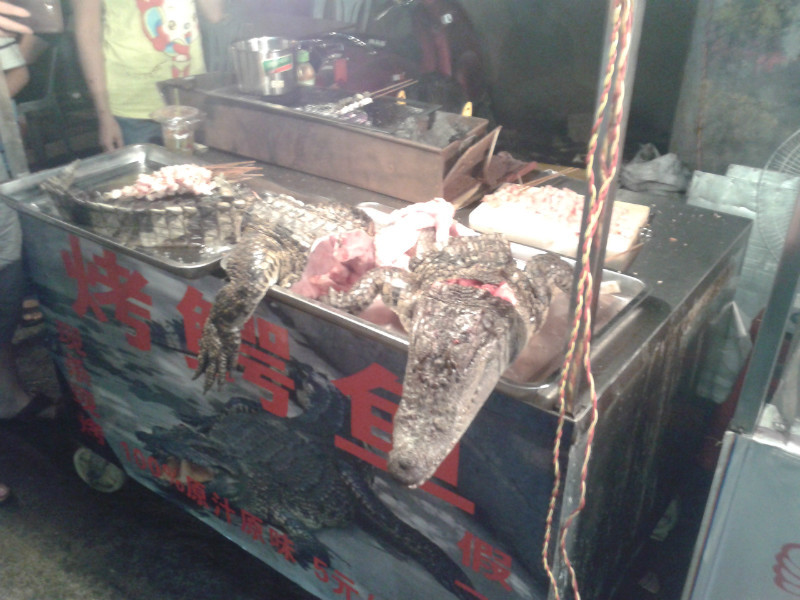
* 10.01 德天瀑布
```md
今天才正式开启游览景点的行程，德天瀑布位于大新县，离南宁大概要四个小时的车程，
早上要一早起，报团最大的好处是有人接送，所以去小的景点报团还是可以的。

导游把你送进景区大门就不管你了，约定时间出来就好。不好的地方是，路上会带你去购物。
大新县物产很丰富，自称是桂圆的原产地。慕名而去，总得买点什么，也跟着买了些桂圆干，120一斤，有些小贵。
中午在大新县吃饭，旅行社安排的午餐，肯定别指望吃好了，吃饱就行，多吃几碗白饭吧。
从大新到德天的这段路上景致也是相当的好，一路都是连绵不绝、层峦叠嶂的山峰，广西的山确实是秀丽。
```

```md
快到景区的时候，就可以看到归春河，河的对岸就是越南，第一次到了正在的边境地区，有点小激动。
归春河发源中国流经越南，再流回中国，因此得名。河面还蛮宽的，水较浅，蹚水就能过河，有边民证就能过境。
一路上越南侧的河边飘着很多竹排，导游说是晚上用来搭浮桥走私的。
因为靠近越南，一路上导游都在讲越南，说越南女人“远看100万，近看50万，正面看给我100万”，
因为越南女人喜欢穿白色的衣服，远看像仙女一样，近看的话，个子比较矮也比较黑，哈哈。

男人的特点是，喜欢戴绿帽子，因为越南近代以来一直不稳定，男人都去当兵，是从军队发展来的传统。
越南是男权社会，女人的地位比较低，而且男的长的也普遍比较矮，所以越南女人很喜欢嫁中国男人，因为中国男人疼老婆、怕老婆，哈哈。
 
下午快一点才到景区，德天瀑布位于中越边境线上，号称亚洲第一、世界第四大跨国瀑布，不管什么，前面加上定词都能变成第一。
```
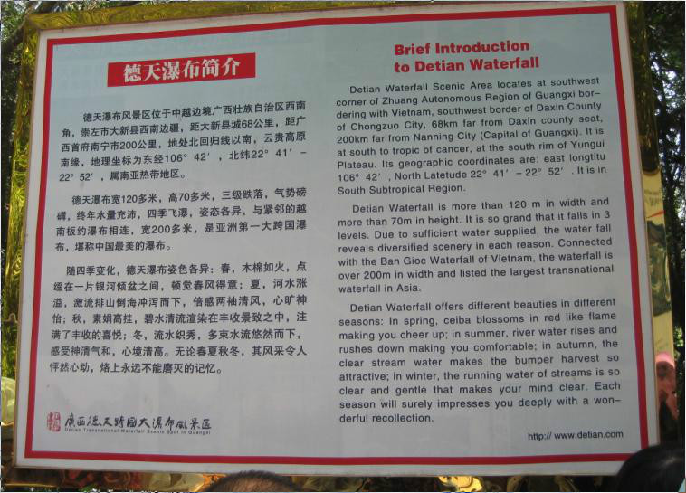
```md
德天瀑布有三级落差，当然最下面的一级是最好看的。
沿着一条小道往前走，就能到达离瀑布最近的地方，30块坐一次竹排，可以从瀑布前转一圈，还可以出一次国，呵呵，因为河的中间线就是国界。
导游说今天越南上游下了雨，瀑布的水量比较大，来的正是时候。

竹筏划到河中央，就有穿着越南服装的小妹围着竹筏兜售越南商品，这会确实没空理她们，竹筏稍纵即过，赶紧拍照。
来到瀑布前，近距离感受瀑布，气势磅礴，一波三折，层层跌落，水势激荡，声闻数里。
```
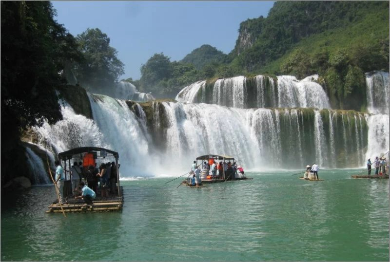
```md
上到岸上，直往前走有一个观景点能一直站到瀑布的旁边，感受又是不一样。
上到景区大道，继续往前就是著名的53界碑啦，这里是陆上的国境线，界碑是1896年中法战争结束后立的，当时越南是法国的殖民地，
中国打了胜仗还赔了不少地，多好的山水啊，就这样轻易的被昏庸的清政府让出去了。
界碑拍照的人太多，排队估计得半个小时，随便拍了张，留个纪念，大家也凑合看吧。
```

```md
这顶帽子就是越南男人喜欢戴的绿帽子，不过这个人应该是中国人~~，旁边是2001年新立的界碑，
界碑的两面刻着中文和越南文的国名，各自朝向自己的国土，在这里出国仅一步之遥。
```
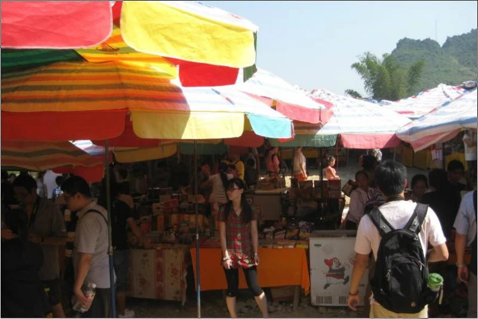
```md
无数的越南小妹再卖越南商品，香水、香烟、糕点、咖啡、手链、越南盾。。。
景区的东西真假难辨，逛了一圈，也没敢下手。找了个小妹一问，说是越南人，也不知道真假，中国话说的无比流利。

沿着上面的景区大道往回走，有几个很好的观景点，可以远观瀑布的全貌，远处群峰浮动，近处花草掩映，如诗如画。
```
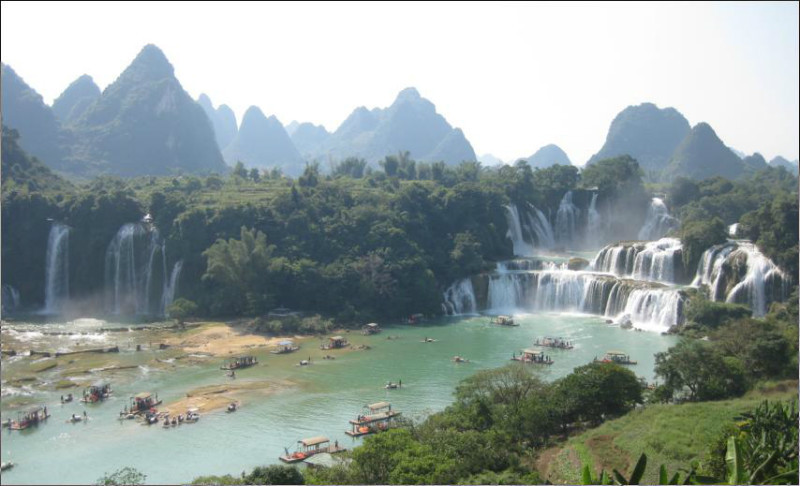
```md
推荐大家选对时间来看看，太美了，我很喜欢。呵呵！
回去又是四个小时，一路上和司机师傅攀谈起来，他告诉我们这些地方也是刚开放不久，因为以前中越边境一直不是很太平。
广西和越南的边境口岸在东兴和凭祥，喜欢热闹的可以去哪里看看，
因为越南的关税很低，中国的很多商品都是从这里出去的。另外，还可以去越南的下龙湾玩一圈。

途中又去了一个购物点，卖玉石的，这里的推销手法很精彩，可能知道现在的游客警戒心理很高，也很反感。
绕了一大圈，讲了一个很感人的故事，还教你怎么辨识缅甸翡翠的真假，以证明他们卖的是真的，旁边几个小妹跟着附和，
总之很精彩，终于有人的防线被打破，我都有点被感动了，呵呵，不过好得也是在三亚待过的人，别想占便宜就OK啦。
 
回到南宁已经很晚，特意找了一家有螺丝粉的店，本以为米粉里有螺丝的，原来螺丝是用来熬汤的，是我瞎想了，呵呵。
```
10.02 桂林
```md
坐了六个小时的火车，下午快3点才到桂林，又一次体会到了广西火车的龟速。
不过还好，我们有耗时间神器——扑克牌，哈哈，大家一同出行的时候别忘了带两副牌。
由于在南宁没订到桂林的房间，人太多了，听说是挤了一千多万人，只好找当地的旅行社报了一个两夜三天的团，
事实证明，这个决定是这次出游最大的败笔，钱倒是不多才560，关键是浪费了宝贵的时间。还好后面及时调整路线，还算尽兴。

下火车就有人来接，直接拉到景点去玩，第一站是南溪山公园，入口处一块石牌上面刻着，桂林山水甲天下，赶紧合个影，也证明咱来桂林了，哈哈。
没什么可看的，就一溶洞，里面用钟乳石雕刻的各式佛像，最后还是老一套，大家坐下来，大师念一遍经文，然后让你捐钱。
这招我在海南东山岭的潮音寺就见识过，当时怀着对佛主无比的虔诚还捐了三百块 ，
现在无比的后悔，捐给希望工程还能起点作用，以佛的名义来赚钱，这些人简直玷污了佛主的威严。

第二站就是象鼻山了，桂林的城徽，那是一定要去看看的，也是第一眼见到的桂林山水，景致比较一般，都是慕名而去看象鼻山的。
坐船转了一圈，在象鼻山前停留几分钟，完事。本来对今天的行程没报太大的希望，也无所谓了。
都说阳朔的山水甲桂林，对明天的行程很是期待。
```
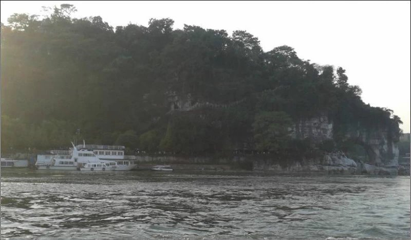
```md
回来的路上，导游说明天的阳朔景点需另外交费，280一人，不去还不行，真是上了贼船了，很是后悔。
很遗憾在桂林没吃到很好的美食，人太多，吃饭的地方都挤满人，而且也没明确想去的地方。
吃完饭就是欣赏两江四湖的夜景了，这是今天最大的收获。

桂林市区的漓江两岸修的很漂亮，可以散步，路两侧绿树掩映，加上幽暗的灯光的配合，比白天喧闹的场景好太多。
环江道很长，边走边看夜景一点也不觉得累，时而看到有人坐在江边闲聊，这时才有点羡慕桂林人。
不知不觉11点了，意犹未尽，走到脚痛，呵呵，不过还是回去了，明天还要保障重点项目。
```
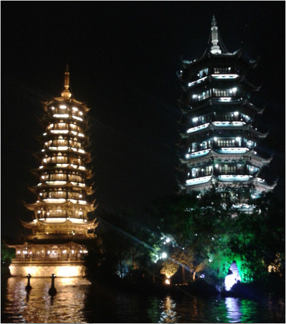
* 10.03 阳朔
```md
这次出游的重点当然看漓江山水了，不过今天的行程很失败，连导游都没有，司机师傅兼做导游的工作，广西的旅游管理很混乱，
到处都是拉私客的，名义上挂在旅行社，应该是自己接客。

先去看阳朔的那几个景点，十里画廊、聚龙洞、鉴山寺、大榕树、月亮山，名字起的都很诗意，景致很一般，平时都没人来的，
基本上也都不收门票，太坑爹了。

整到一点吃过饭，这些都忍了，终于等到游漓江。等到景点一看，嗬，这架势，简直就是百舸争流啊，比漓江的山水游气势多了。
不得不感慨现在的中国人为了利益，什么都不管不顾了，资源都过度的开发，迟早毁了这片秀丽的山水。

坐上电动小竹筏，开的飞快，我说能不能开慢点，驾船的大哥直接跟我们说，现在时间就是金钱，无语了，算了，也理解他吧。
时间把握的恰到好处，15分钟去，开哪算哪，再15分钟回，全都走马观花了，而且看的还不是漓江的精华断。
不过即使这样，也能感受到漓江山水的秀丽，更坚定了要徒步一次的决心。
```
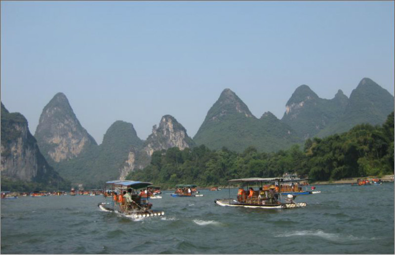
```md
上了岸，我们是第一坐船的，还得等其他人，这方面总是不落后于人哈。
此处离西街不远，早已慕名，赶紧去看看，刚走了西街口，司机师傅就来电话了，只好回头，也算看了一眼西街了。总体印象，人多。
 
晚上回到住处，不算晚，今天被搞的很累，还很扫兴，本来打算再去看看夜景的，也没心情再去了。
明天旅行社安排的景点直接放弃，准备徒步看一次漓江，然后到兴坪古镇住宿。
```
* 10.04徒步漓江
```md
早上坐去阳朔的车去杨堤乡，行李太重直接寄存在汽车站了，每天5块钱。
去阳朔的班车由于国庆人多，不在杨堤乡停了，只能做黑车了，车费30块，
下了车就被鄙视了，遇到俩桂林本地的90小夫妻也是来游漓江的，说到阳朔才20块，我们说算了，黑的就是我们这些人，后面跟着你们好了。
小姑娘很爽朗，很健谈，他们是来坐船的，说她能找到便宜的船，听了这话，有两货心动了，立马跟着别人坐船去了。
也好，他们去帮忙打前站，找住宿的地方。我和黎tx还是准备徒步，边走边看。
六个人个坐了辆小面的到杨堤码头，小姑娘砍了半天价，最后五十块，也差不多这样了。
```
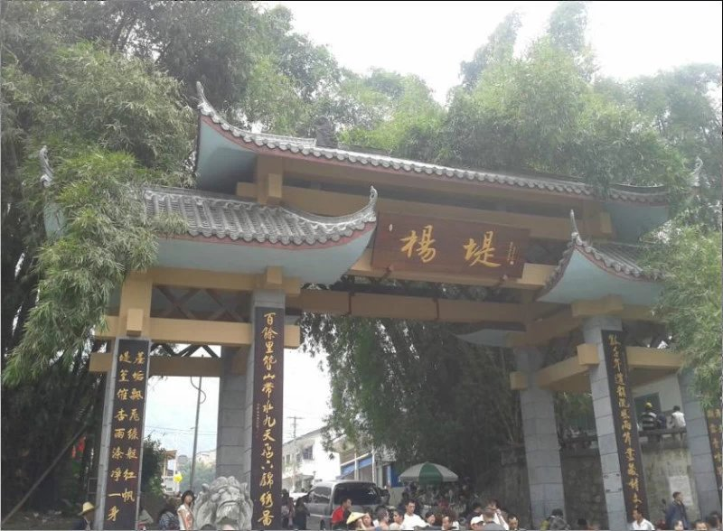
```md
杨堤到兴坪是漓江山水的精华段，下面是徒步路线图，昨天游的是最下面靠近阳朔的那一段。
```
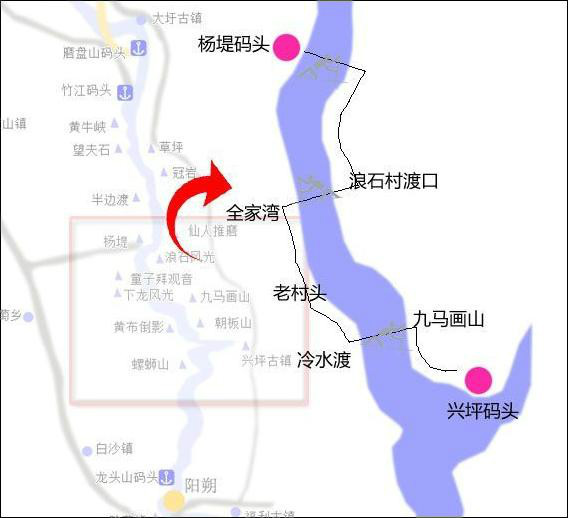
```md
在杨堤码头就要渡到对岸去行走，平时只需四五块，今天20才解决。
过到对岸，走不多远就能看到神笔峰，有人说像关公,远看确实是挺像的。
```
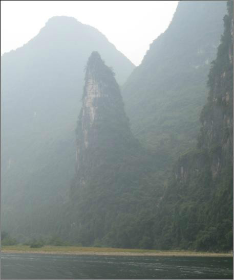
```md
大约一个小时，到达第二个渡口浪石村渡口，对岸是全家洲。
有老乡卖稀饭，刚好中午还没吃饭，整了两碗绿豆粥，吃了几个柿子，很甜，还是农家的风味好。
休息了下继续走，一路都是沿着江岸边的石堤，道比较窄，有的地方还有点难走。

一路走来，映入眼帘的是一幅幅的山水画，漓江景致尽收眼底，这才是漓江山水的精髓，总算领略了。
唯一有点遗憾的是今天是阴天，拍照的效果不太好。
烟雨漓江也是另外一番风情，不过今天只有薄雾，没有雨啦。
```
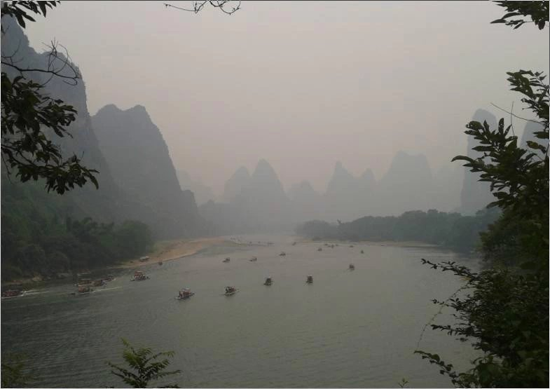
```md
美景太多，刚走了一半相机就拍的没电了 ，只能靠手机了。
路上还遇到不少徒步的人，遇到两小伙子，从广东一直骑行到这里，那么难走的路，带着自动车徒步漓江，太佩服他们了。

大概走到一个叫冷水村的地方，再一次渡船，也是最后一次。
这里收费10块，船上还碰到四个俄罗斯美女，长的都很好看，看着像选美的 。
这里还有一景，九马画山，说是能看出九匹马，我是想象力太差了，看了半天一匹马都没看出来。
```
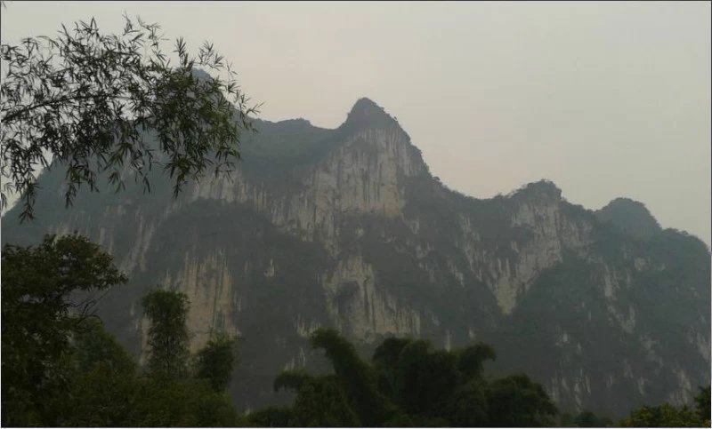
```md
过了冷水渡口，徒步的人就少了，这里可以坐车直接去兴坪，我们还是打算走到兴坪，一路黄色槐花点缀漓江。
```
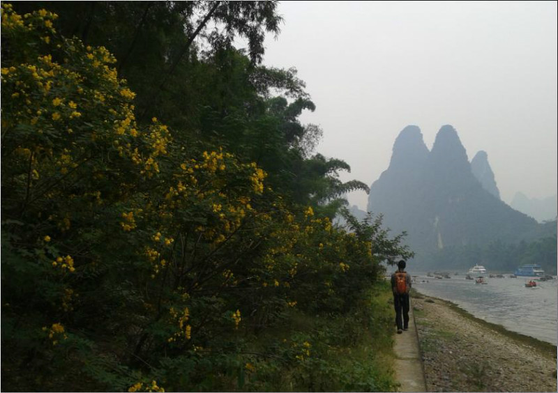
```md
徒步就行走江堤的水泥台上面，现在漓江的水位小，河滩上能能走。
再来一幅山水画，一般在漓江转弯的地方景都很好，峰峦叠嶂，和江水相互映衬，十分壮观。
```
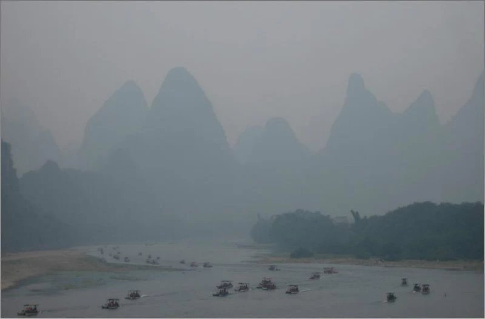
```md
大致快到兴坪镇的时候，就可以看到二十元纸币背面的图了，特别设置了一个观景点，
拿着二十块钱的纸币对照着看了半天，确实神似，只是漓江现在的水小了些。
```
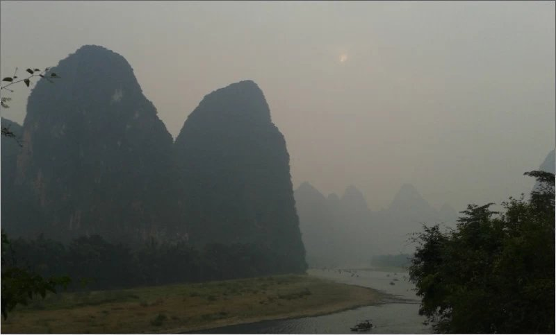
```md
再过不多久，就到达兴坪古镇，整个徒步结束，大约走了20公里，用时4个半小时，算走的比较快。
整个徒步过程，饱尽了漓江的风采，回味无穷，意犹未尽。
而且岸边好多住宿的地方，还能租帐篷，只恨没早点来徒步，昨天浪费了一天的时间，此时更加后悔。
```
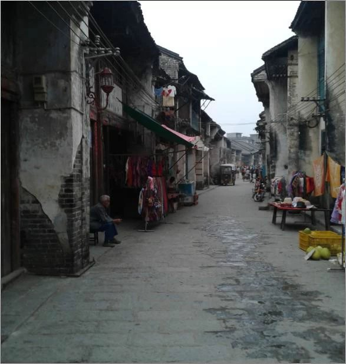
```md
走了这么久，有点饥肠辘辘，又是一碗卤菜粉解决问题，大餐到阳朔再说。到阳朔的车20块，大概1个小时的样子。
打电话知道他们已经在阳朔找到了住处，本地人就是牛，省了不少事，也省了不少钱，还满足了我们本来就打算在阳朔住一晚的想法。
 
到阳朔快8点了，抓紧时间洗洗澡休整下，立马去西街逛逛。西街是一条洋人街，满街的酒吧，能看到很多外国人。
不过今天就算有外国人估计也很难辨认出来，满街的人，只看到黑压压的一片。
我不是太喜欢人多的地方，走了几十米就不想走了，没什么兴趣了，还是撤吧。
```
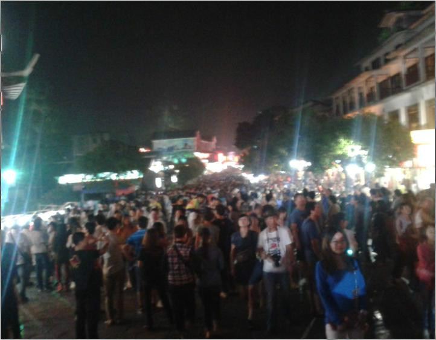
* 10.05龙胜
```md

昨天早上去杨堤之前在火车站买好了撤退的票，晚上大概11的火车去湛江。他们都不想去龙胜了，我还是想去看下蔚为壮观的龙脊梯田。
独自出发也很Happy，终于给我一次单独行动的机会 。

早上6点半起床，走在阳朔的大街上，已经没有了昨夜的喧闹，街面刚打扫过，比较干净，稍微挽回一点好印象。
```

```md
去龙脊梯田还是有些麻烦的，早上坐阳朔的班车先回桂林，车费20。
汽车总站没有去龙胜的车，要去琴潭车站，然后坐去龙胜的班车，在和平乡下车，车费19块，正规的在车站买票坐车还是比较靠谱的。
很幸运，刚好赶上五分钟之后的班车。近两个小时到达和平乡，车还没到景区就让下车上另外一辆车上，车是去大寨的。

龙脊梯田景区共有三个寨，古壮寨、平安寨、大瑶寨（简称大寨），大寨是最远，不过那里的金坑梯田是规模最大的，更加壮观。
由于时间太紧，我本来的打算是，先到古壮寨，然后走到平安寨给大家寄寄明信片就返回，不去大寨了。

现在的状况是车停在半山腰，连问路的人都找不到，只好跟着去大寨了。看来做足功课还不行，还得有很强的应变能力。
上山的班车车费倒也不贵10块，门票从前年的50涨到了80，进了景区可以随便玩，三个寨子都可以去。
时间充裕的话，可以从古壮寨一直走到大寨，可能要要走四五个小时。
上山的一条小环山路九转十八弯，还堵车，自驾车狂多，有些后悔跟着来大寨了，怕赶不上晚上回桂林的班车。
```
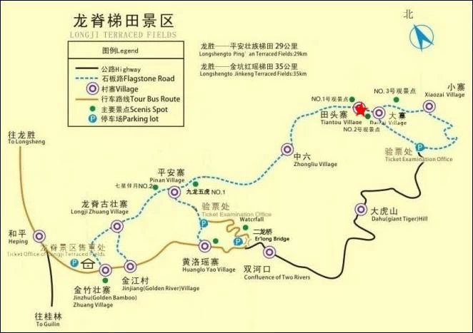
```md
折腾到近2点钟，终于到了，中午没吃饭，路旁满街的竹筒饭，先来一份，10块钱。
算是这里的特色，怎么的也得尝尝，竹筒里面放的糯米和腊肉，口上塞一个玉米梗，直接放火上烧。
味道也没什么特别的，肚子很饿，也没觉得多好吃。连问几个人上山要多久，我需要把握好时间，还好一个小时。
刚爬了几十米，真觉得这里真像世外桃源。
```
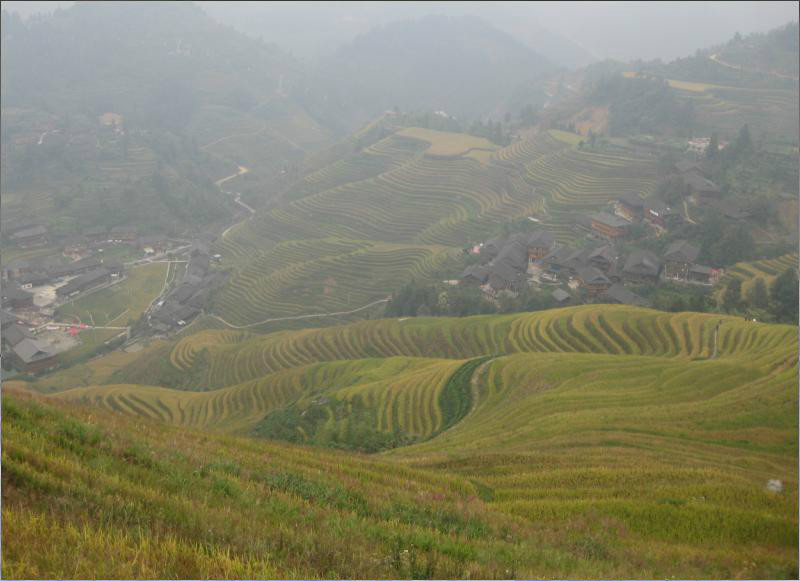
```md
第一次去少数民族聚居的地方，还是蛮有新鲜感的，其实这里的商业气息也比较浓了。
很多的宾馆，如果行李比较多，这里还有当地人帮忙背包上山，当然是要收费的。
我在想成了旅游景点，不知道对当地人是好事还是坏事，可能是有钱了，但是破坏了那份宁静、纯朴的感觉。
 
我走的比较快，45分钟的样子到了山顶，真的很壮观，依靠双手一层层垒起的梯田。金秋十月，稻子基本成熟了。
就是天气差了点，阴天影响了观景的效果，远处的梯田有些看不清楚，相机拍摄的效果也不好。
```
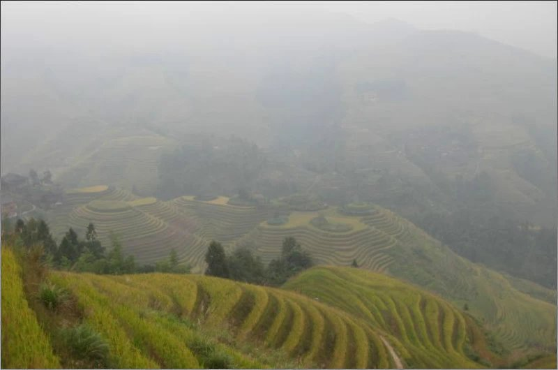
```md
坐在田埂上休息了会，空气很好，赏赏景、拍拍照，很是惬意，顺便打了几个电话给大家，分享分享我此时的感受，呵呵。
```
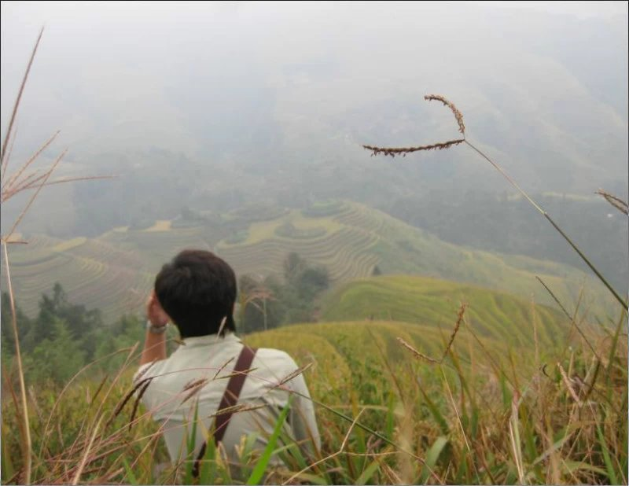

```md
3点10分的样子，准时下山。
其实来龙脊梯田这里最好是住一晚，晚上可以欣赏落日，早上看看日出，几个寨子之间串串。
像我这样来去匆匆，没能完全体验到这里意境。
 
一路下到山脚，问了几个人，有没有寄明信片的地方，都说没有，只好作罢，到桂林再说吧。
回去的路又是一阵堵，还好坐上了桂林的班车。去到桂林已经快8点，中途下了车因为要去汽车站取行李，
本来想打车过去的，想想还没坐过桂林的Bus，还是乘公车吧，反正也不远。
桂林的Bus还是很不错的，很宽敞，也很干净。
 
到了火车站还是想给大家寄寄明信片，旁边就是邮局，可惜下班了，门口有个邮箱，
但是没有邮票，旁边的书刊亭都不卖邮票，万事具备只欠东风，拿着一手的明信片寄不出去，太悲剧了。
大家出去玩，如果要寄明信片，一定要记得自备点邮票。
 
至此这次出行基本结束，原本计划的地方都去了，只是中间浪费了一天的时间，本来是可以在龙脊梯田那天住一夜的。
虽有些小遗憾，但整体还算满意，积累了出游的经验，下次应该可以玩的更畅快。
 
剩下的事情就是返回三亚，如果确定好计划，就可以直接在桂林坐飞机回，不用像我们又是火车、汽车、轮船的折腾，6号晚上才到海口。
在这里稍作停留，和Boss 李一起吃了个晚饭，11点终于顺利回到阔别已久的三亚。
```
```md
———————— End  ——————
```